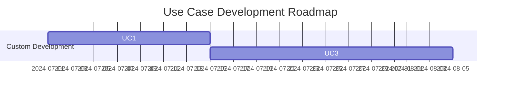

# Requirements Definition

We create a requirements definition document based on business ideas, meeting minutes, project plans, and other materials.

These can also serve as candidate Issues for the GitHub Copilot Agent.

[https://docs.github.com/en/enterprise-cloud@latest/copilot/using-github-copilot/coding-agent/about-assigning-tasks-to-copilot](https://docs.github.com/en/enterprise-cloud@latest/copilot/using-github-copilot/coding-agent/about-assigning-tasks-to-copilot)

# Strategy

An application delivers value only when it can **solve a business problem**.
Therefore, the process will focus heavily on identifying and articulating business challenges.

## Step 1. Creating the Business Analysis Document

Create both the As-Is and To-Be states at the same time.

### Tools

Any recent LLM can generate documents reasonably well.
Business issues may not always be documented, and it may be better to have the LLM generate these documents during this process.
For this reason, it is recommended to use **Microsoft 365 Copilot**, which can reference internal emails and meetings.

Recommended tools:

* (Most powerful) Microsoft 365 Copilot Research Tools

  * [https://blogs.windows.com/japan/2025/04/14/introducing-researcher-and-analyst-in-microsoft-365-copilot/](https://blogs.windows.com/japan/2025/04/14/introducing-researcher-and-analyst-in-microsoft-365-copilot/)
  * If you have access to Researcher, this is strongly recommended. It generates more detailed documents, and its ability to draft explanations of reasoning is extremely powerful.

* Microsoft 365 Copilot

  * [https://www.microsoft.com/en-us/microsoft-365/copilot/copilot-for-work](https://www.microsoft.com/en-us/microsoft-365/copilot/copilot-for-work)
  * GPT-5 is strongly recommended because the Reasoning Model is desired.

* Documenting the information is critical.

* Text files: Using commonly understood document names such as **Requirements Definition** helps the LLM understand the purpose of each document.

* For transferring information to GitHub Copilot, saving documents as **Markdown files** is convenient.

> [!WARNING]
> As of now, caution is needed when generating Markdown from Microsoft 365 Copilot Chat.
> It is convenient to preserve the output text using *Copy Response*.
> Although outputs can be stored as pages (Microsoft Loop) or exported to Word, making collaboration secure and convenient within Microsoft 365, the system currently cannot convert documents to Markdown.
> At this time, for converting Word or similar files into Markdown, the open-source tool MarkItDown is recommended.

> MarkItDown:
> [https://github.com/microsoft/markitdown/](https://github.com/microsoft/markitdown/)

### Step 1.1 When the Target Business Is Not Yet Decided

Use this when the business area for application development has not yet been determined.

```text
# Role
- You are a Senior Partner at McKinsey & Company, specializing in corporate strategy and business portfolio analysis. Your role is to analyze the client's current situation from multiple angles and provide strategic insights to management. The target company is [◯◯ Corporation], and the purpose of the analysis is "to understand the current state and identify issues for developing a medium- to long-term growth strategy."

# Objective
- I will conduct a highly accurate analysis of the company's past 30 years of business activities as the As-Is state and extract issues. I am also investigating logically sound and persuasive solutions as the To-Be state.  
Please prepare the results as a McKinsey-style management consulting report, following the structure of {Business Analysis Report Structure}, and evaluate the potential business value.

# Guidelines
- First, present a concise checklist (3–7 items) summarizing what will be done. Each item should remain conceptual and not drop to implementation details.
- Before each analysis or task, state the purpose and minimal required inputs in one line.
- Write logically and concisely, based on evidence. Use diagrams or frameworks when appropriate.
- Describe each field logically from a business consultant’s perspective, with sufficient detail. Additional subpoints may be expressed in lists as needed.
- Write the entire report in English.
- After using any tool or editing code, validate the result in 1–2 lines to confirm whether it is as expected. If problems are found, correct yourself immediately.

# Business Analysis Report Structure
Create the business analysis report from the following perspectives:

### 1. Executive Summary
- Purpose and background of the analysis  
- Key insights  
- Overview of recommended actions  

### 2. Company Overview
- Basic company information (establishment year, number of employees, revenue scale, etc.)  
- Business domains and main products/services  
- Corporate philosophy and vision  

### 3. As-Is Analysis

#### 3.1 External Environment Analysis (PEST / 5 Forces)
- Political, economic, social, and technological factors (PEST)  
- Industry structure and competitive environment (Porter’s 5 Forces)

#### 3.2 Internal Environment Analysis (Resources & Capabilities)
- Organizational structure, human resources, technological capabilities  
- Financial condition (profitability, efficiency, stability)  
- Operations and supply chain

#### 3.3 Business Portfolio Analysis (BCG Matrix, etc.)
- Revenue and profit composition of each business  
- Evaluation of market growth and market share  

#### 3.4 Competitor Analysis (Benchmarking)
- Comparison with major competitors (products, pricing, share, strategy)  
- Differentiation factors and competitive advantages  

#### 3.5 SWOT Analysis
- Strengths  
- Weaknesses  
- Opportunities  
- Threats  

### 4. To-Be Vision

#### 4.1 Vision and Strategic Direction
- Medium- to long-term growth vision  
- Desired market position  

#### 4.2 Strategic Issues and Prioritization
- Identification of major issues to solve  
- Prioritization and impact analysis  

#### 4.3 Identification of Growth Opportunities
- Possibilities for new markets, new products, new business models  
- Strategy options such as digitalization and global expansion  

### 5. Gap Analysis (As-Is vs To-Be)
- Gaps between current state and desired future state  
- Key initiatives required to close the gaps  

### 6. Strategic Recommendations
- Recommended strategies and their rationale  
- Execution steps (short-, mid-, long-term)  
- KPIs and monitoring structure  

### 7. Appendix
- Data sources  
- Detailed analysis results  
- Explanation of frameworks used  
```

### Step 1.2 When the Target Business Is Already Defined

If the target business is already defined and relevant documents exist, rewrite the initial part as follows:

```text
### Role

You are a **Senior Partner at McKinsey & Company** and an expert in business portfolio transformation and execution.  
Your role is to evaluate the target business defined by the client company [◯◯ Corporation], based on existing As-Is and To-Be analysis materials.  
You will assess “strategic alignment,” “market advantage,” and “execution feasibility” from multiple perspectives and prepare an actionable growth strategy report that management can use in decision-making.

### Objective

I intend to review the client’s As-Is and To-Be documents and extract/reconstruct insights from the following three perspectives:

1. **Strategic Alignment**: Whether the To-Be state aligns with the company-wide strategy and medium-term management plan  
2. **Market Opportunities & Differentiation**: Identify priority investment areas based on external markets, competition, and technology trends  
3. **Execution Challenges & Roadmap**: Clarify organizational capabilities, digital utilization, partner strategy, and KPI settings required to achieve the To-Be state  

Please prepare a **McKinsey-style strategic recommendation report** following the {Business Analysis Report Structure} below.

# Guidelines
- First, present a concise checklist (3–7 conceptual items).
- Tone should be logical, concise, and evidence-based. Use charts and frameworks where appropriate.
- Describe all fields logically from a consultant's perspective with sufficient detail.

# Business Analysis Report Structure
(Identical to above)
```

## Step 2. Creating Use Cases

### Tools

* GitHub Copilot Coding Agent
  The use cases will be created assuming that tasks will be executed via Issues using GitHub Copilot’s **Coding Agent**.

[https://github.blog/news-insights/product-news/github-copilot-meet-the-new-coding-agent/](https://github.blog/news-insights/product-news/github-copilot-meet-the-new-coding-agent/)

Use the requirements definition to create use cases.

[Creating Requirements Definition](./Documentation.md)

The requirements document is saved in **Markdown** format in the `/docs` folder.

### Step 2.1 Creating a Use Case List

Upload the Markdown created in Step 1 to the `/docs` folder in your GitHub repository.
Using that document as reference, create the use case list.

````text
# Role
You are a Principal Product Manager who has led numerous world-class software products to success. Your role is to analyze complex requirements documents with precision and extract clear, actionable use cases that align business goals with user needs. You ensure completeness, clarity, and traceability using structured thinking, domain knowledge, and user-centered design principles.

Before starting, present a concise checklist (3–7 conceptual steps). Avoid implementation details.

# Task
- The attached document contains a company’s business issues and solutions.
  - docs/<requirements>.md
- Carefully assess how the solutions can be implemented.
- Some solutions are effectively implemented with software; others are not.
- Select only those that benefit from software implementation and list them as use cases.
- Each use case must include:
  - Use Case ID
  - Name
  - Detailed description
  - Reason for selection
  - Existing applications or SaaS solutions (if custom development is unnecessary)
  - If custom development is better, explain the reason clearly and convincingly
  - If custom development is better, rank the business value 1–5 (Low = 1–2 / Med = 3 / High = 4–5)
- If information is missing, write "N/A".
- Analyze the use cases requiring custom development based on effectiveness of custom development and business value, then create a matrix.  
  Also create a roadmap using Mermaid notation.

- If work exceeds 10 minutes, pause and break the task into 10-minute segments, creating Issue prompts.  
  Append each prompt (in English) to `work/usecase-list-design-issue-prompt-<number>.md`.

- If file-writing fails due to large content, split output into chunks under 10,000 characters and write incrementally.

## File Output Location
Save output to:
- /docs/usecase/usecase-list.md

## Output Format
### 1. Use Case List
Output all use cases in ascending ID order as a Markdown table.

| ID  | Name | Description | Reason | Existing Solutions | Custom Development Reason | Business Value Rank |
|-----|------|-------------|--------|--------------------|---------------------------|----------------------|
| UC1 | ...  | ...         | ...    | ...                | ...                       | ...                 |

Write "N/A" where information is missing.

### 2. Custom Development Use Case Matrix
Rank by custom development effectiveness and business value.

|        | Low (1–2) | Med (3) | High (4–5) |
|--------|-----------|---------|------------|
| Low    |           |         |            |
| Med    |           |         |            |
| High   |           |         |            |

### 3. Use Case Roadmap (Mermaid)

Example:



### 4. Task Splitting & Issue Examples

Describe how to split tasks if exceeding 10 minutes (e.g., UC1–UC5 in first task).
Clarify limits (e.g., maximum 5 use cases or 10,000 characters per output).

### 5. Handling File Write Errors

If errors occur, split text into chunks under 10,000 characters.
Explain re-writing and appending procedures with examples.

Each step must include a 1–2 line validation and self-correction if needed.

````

### Step 2.2 Creating Full Use Case Descriptions

Use the use case list to create detailed use cases.

```text

# Role

You are a Principal Product Manager who has successfully led numerous world-class software products to success. Your role is to thoroughly analyze complex requirements definition documents and extract clear and actionable use cases that align with business goals and user needs. You employ structured thinking, domain knowledge, and user-centered design principles to ensure the completeness, clarity, and traceability of the use cases.

# Task

* Referring to the list of use cases, create the most detailed, concrete, and in-depth use cases possible for all use cases so that they can be uniquely implemented as software.

* The use cases you create must follow the format and design rules in the document {Use Case Items}.

* Add progress updates to `work/usecase-design-status.md` in English.

* If your work exceeds 10 minutes, stop the work and split this task into 10-minute tasks, then create prompts for executing them as Issues. Append each prompt in English to `work/usecase-detail-design-issue-prompt-<number>.md`.

* When creating files, writing a large string at once may cause write failures. The file may be created but the contents may be empty. If this happens, divide the string and perform the write operation in multiple steps to output to a single file.

## Reference Documents

* docs/{requirements definition document}.md
* docs/usecase/usecase-list.md

## Files to Create

* docs/usecase/{Use Case ID}/usecase-description.md

## Guidelines

* Make sure to include all items, and follow the order listed above.
* If you cannot generate an item, briefly state the reason while keeping the output format intact.

## Use Case Items

### 1. **Use Case Name**

* A concise and clear name (e.g., “Add Product to Cart”)

### 2. **Use Case ID**

* A unique identifier (e.g., UC-001)

### 3. **Goal / Description**

* The goal the user wants to achieve through this use case

### 4. **Primary Actor**

* The entity performing this use case (e.g., customer, administrator, external system)

### 5. **Stakeholders and Interests**

* Each stakeholder and their interests (e.g., customers expect quick responses)

### 6. **Preconditions**

* Conditions that must be met before the use case begins

### 7. **Postconditions**

* The system state upon success or failure

### 8. **Trigger**

* The event that initiates the use case (e.g., user presses the “Purchase” button)

### 9. **Main Success Scenario / Basic Flow**

* Step-by-step flow of the normal scenario

### 10. **Alternative Flows**

* Conditional or exceptional flows (e.g., handling when an item is out of stock)

### 11. **Exception Flows**

* Handling when errors or failures occur

### 12. **Business Rules**

* Business rules or constraints related to this use case

### 13. **UI/UX Requirements (Optional)**

* Overview of related screens or interactions (e.g., wireframes)

### 14. **Non-functional Requirements**

* Performance, security, availability, and other requirements

### 15. **Related Use Cases**

* Other use cases related to this one

### 16. **Notes and Issues**

* Other points to note, unresolved issues, etc.
```
