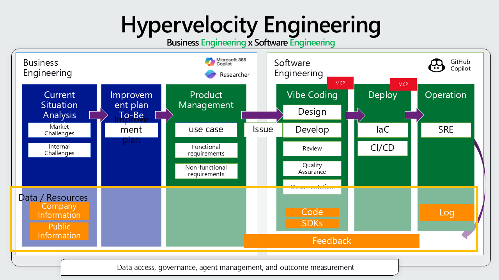
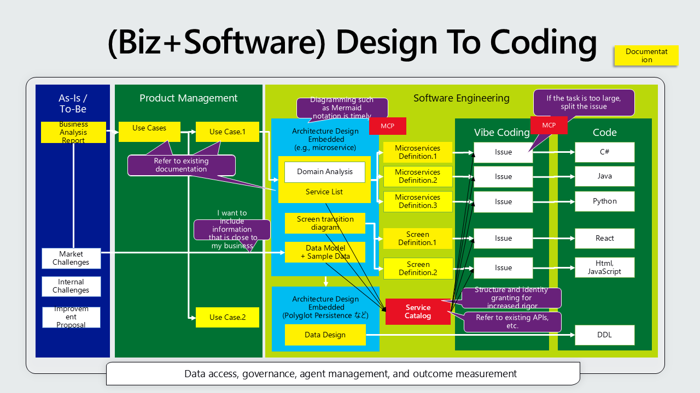
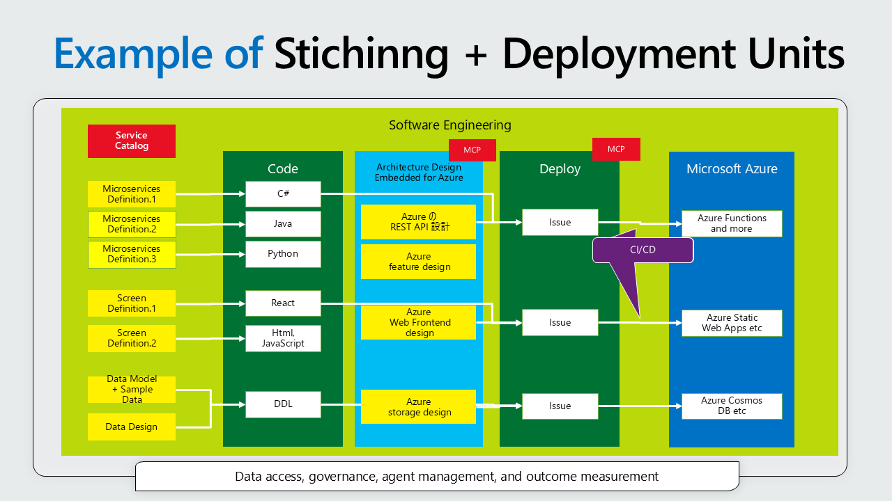

# Prototype to MVP Development of Applications

# Introduction

This document provides a comprehensive guide for developing applications from prototype to MVP using GitHub Copilot, with a focus on the Coding Agent. It outlines a structured methodology that begins with setting up the development environment, including configuring the GitHub repository with custom instructions, MCP servers for Azure and Microsoft Docs access, and specialized Custom Agents for various development phases.







The guide details a step-by-step process:

Repository Setup: Creating custom instructions, configuring MCP servers, and integrating pre-built Custom Agents for tasks like architecture design, implementation, and review.
Business Documentation: Preparing requirement definitions and use cases.

Application Design: Designing the application architecture, such as microservices.
Implementation and Deployment: Coding the application and deploying it to Azure.

It also covers the use of tools like GitHub Copilot Spark and Visual Studio Code to complement the workflow. A hands-on lab is included for practical experience. Finally, the document provides troubleshooting tips for common issues encountered when working with the GitHub Copilot Coding Agent, such as premature task completion and CI/CD job failures.

Best practices for working on tasks using Copilot.

[https://docs.github.com/en/copilot/using-github-copilot/coding-agent/best-practices-for-using-copilot-to-work-on-tasks](https://docs.github.com/en/copilot/using-github-copilot/coding-agent/best-practices-for-using-copilot-to-work-on-tasks)

* Please exercise extreme caution when using this in a production environment. Whether or not to merge a Pull Request is **a human** decision!

## Tools

* GitHub Copilot Coding Agent

  This assumes that you will have GitHub Copilot's **Coding Agent** work on tasks via the Coding Agent Issue.

  [https://github.blog/news-insights/product-news/github-copilot-meet-the-new-coding-agent/](https://github.blog/news-insights/product-news/github-copilot-meet-the-new-coding-agent/)

  * Firewall settings

    * To access several Azure resources, firewall settings are required. In the GitHub repository, go to [Settings] - [Copilot] - [Coding agent] - [Internet access] - [Custom allowlist] and add the following domains:

      * [https://management.azure.com](https://management.azure.com)
      * [https://login.microsoftonline.com](https://login.microsoftonline.com)
      * [https://aka.ms](https://aka.ms)
      * [https://app.aladdin.microsoft.com](https://app.aladdin.microsoft.com)
  * It's up to your judgment, but to use various MCP Servers, it may be acceptable to temporarily set [Enable Firewall] to `Off`.

* GitHub Copilot Spark
  The preview feature that synchronizes React-based screen creation with the GitHub repository is excellent. By cloning the repository, you can even use it to preview work results on the repository side.

  [https://github.com/features/spark?locale=ja](https://github.com/features/spark?locale=ja)

* Visual Studio Code + GitHub Copilot Agent Mode

  **Visual Studio Code** is also highly recommended.

  * Use the Markdown preview feature for document review and editing

  * Generate lists of various Azure resources using Azure MCP Server

  * Add manually created files to the GitHub repository

  * Test and adjust code generated by GitHub Copilot

  * Coding assistance with GitHub Copilot Agent mode

  * When using Microsoft Azure SDKs, use GitHub Copilot for Azure.

    [https://learn.microsoft.com/en-us/azure/developer/github-copilot-azure/introduction](https://learn.microsoft.com/en-us/azure/developer/github-copilot-azure/introduction)

# Hands-on Lab

This is a hands-on lab that takes about an hour, referencing sample requirement specifications and design documents based on **membership services**.

[Hands-on Text](HOL.md)

# Step.1. Create a GitHub Repository

Create a GitHub Repository. This repository will be used for GitHub Spark and GitHub Copilot Coding Agent work.

## Step.1.1. Create Custom Instructions

Create a `.github/copilot-instructions.md` file in your GitHub repository so that GitHub Copilot Coding Agent can execute tasks more accurately.

Below is an example.

Note that Microsoft Docs and Azure **MCP Server** are specified. Remove them if unnecessary.

```text
## Guidance
GitHub Copilot Coding Agent will perform tasks according to the following guidelines:
- If information is insufficient to create or execute a plan, ask the user

## Searching Microsoft Official Documentation

You have access to an MCP server named **MicrosoftDoc**. Using this tool, you can search Microsoft’s latest official documentation, which may be more detailed or newer than the information included in your training dataset.

When responding to questions involving Microsoft Azure, C#, F#, ASP.NET, Microsoft.Extensions, NuGet, and other native Microsoft technologies—especially when they are specific or specialized—please use this tool for investigation.

## Searching Microsoft Azure Resources

You have access to an MCP server named **Azure**. Using this tool, you can create, update, delete, and read Microsoft Azure resources, and this information is more accurate than what is included in your training dataset. For example, you can interact with Azure resources from other AI agents using commands like:

- "Show all resource groups"
- "List the BLOBs inside a storage container named 'documents'"
- "What is the value of the 'ConnectionString' key in App Configuration?"
- "Query Log Analytics workspace for errors in the last hour"
- "Show all Cosmos DB databases"

## Repository Structure

- `lib/`: Stores main library packages.  
- `admin/`: Contains components for the admin interface.  
- `config/`: Stores configuration files and templates.  
- `docs/`: Stores documentation.  
- `data/`: Stores data files used by the application.  
- `test/`: Stores helpers and fixtures for testing.  
- `src/`: Stores pre-build code for the web application.  
- `app/`: Stores build output for the web application.  
- `api/`: Stores API code.  
- `infra/`: Stores infrastructure code.  
- `work/`: Tracks work progress.

## Architecture and Design Principles

### Authentication and Security
- **Never hardcode credentials**
- Use Azure Key Vault to manage sensitive information
- Use managed identities whenever possible
- Configure RBAC based on the principle of least privilege
- Enable data encryption and secure connections

### Infrastructure as Code
- Prefer Azure Bicep for IaC files
- When using Terraform, follow Azure best practices
- Use resource tokens for all resource names
- Apply appropriate tagging and resource organization

### Error Handling and Reliability
- Implement retry logic with exponential backoff for transient faults
- Add proper logging and monitoring
- Include a circuit breaker pattern when necessary
- Ensure proper cleanup of resources

### Performance and Scaling
- Use database connection pooling
- Configure concurrency and timeouts
- Implement caching strategically
- Monitor resource consumption
- Optimize batch operations

## Coding Standards

### Language-Specific Best Practices

#### Python
- Follow the PEP 8 style guide
- Use type hints
- Document functions and classes with docstrings
- Write tests using pytest

#### JavaScript/TypeScript
- Use ESLint and Prettier for code quality
- Prefer TypeScript
- Implement proper error handling and logging
- Write tests using Jest or Vitest

#### C#/.NET
- Follow .NET coding conventions
- Enable nullable reference types
- Use ConfigureAwait appropriately
- Write tests using xUnit

### Documentation
- Include a comprehensive README.md for each project
- Auto-generate API documentation (OpenAPI/Swagger)
- Use inline comments to explain complex logic
- Record architectural decisions

## AI and Prompt Engineering

### Prompt Design
- Provide clear and specific instructions
- Include context and examples
- Encourage a step-by-step reasoning process
- Clearly specify output formats

### Security Considerations
- Implement measures to prevent prompt injection attacks
- Set guardrails to prevent leakage of sensitive information
- Validate and sanitize user input properly

## Deployment and CI/CD

### Azure CLI (azd)
- Use the `az` command whenever possible
- Properly configure the `azure.yaml` file

### GitHub Actions
- Configure secure CI/CD pipelines
- Use Azure service principals or OIDC
- Manage environment-specific settings
- Include automated testing and security scans

## Data Management

### Database Operations
- Use parameterized queries
- Implement proper indexing strategies
- Handle connection management properly
- Enable encryption
- Monitor query performance

### Storage Operations
- Choose appropriate upload methods based on file size (simple <100 MB, parallel if larger)
- Use batch operations for multiple files
- Set appropriate access tiers
- Manage concurrency

## Quality Assurance

### Testing Strategy
- Implement comprehensive test strategy including unit, integration, and E2E tests
- Aim for 80%+ test coverage
- Use mocks and stubs appropriately
- Manage test data properly

### Code Quality
- Use static analysis tools
- Follow code review guidelines
- Periodically assess and address technical debt
- Conduct performance testing

## Special Notes

Since this project is primarily intended for using generative AI in a Japanese environment:
- Prioritize Japanese comments and documentation
- Consider Japanese laws and compliance requirements
- Understand challenges unique to Japanese natural language processing
- Reflect cultural contexts and business practices
```

Best practices for working on tasks using Copilot:

[https://docs.github.com/en/copilot/using-github-copilot/coding-agent/best-practices-for-using-copilot-to-work-on-tasks#adding-custom-instructions-to-your-repository](https://docs.github.com/en/copilot/using-github-copilot/coding-agent/best-practices-for-using-copilot-to-work-on-tasks#adding-custom-instructions-to-your-repository)

## Step. 1.2 MCP Server Configuration

Configure MCP Servers in your GitHub repository so GitHub Copilot Coding Agent can use them.

Refer to both blog posts below to configure Microsoft Learn and Azure MCP Servers.

* Configure Azure MCP Server for GitHub Copilot Coding agent:

  [https://qiita.com/dahatake/items/3230a92532c35fec7599](https://qiita.com/dahatake/items/3230a92532c35fec7599)

* Configure Microsoft Learn Docs MCP Server for GitHub Copilot Coding agent:

  [https://qiita.com/dahatake/items/4f6f0deb53333c0200ef](https://qiita.com/dahatake/items/4f6f0deb53333c0200ef)

Configuration string for GitHub Copilot Coding Agent MCP Server:

```text
{
  "mcpServers": {
    "Azure": {
      "type": "local",
      "command": "npx",
      "args": [
        "-y",
        "@azure/mcp@latest",
        "server",
        "start"
      ],
      "tools": ["*"]
    },
    "MicrosoftDocs": {
      "type": "http",
      "url": "https://learn.microsoft.com/api/mcp",
      "tools": ["*"]
    }
  }
}
```

## Step. 1.3 Configure and Use Custom Agents

With GitHub Copilot Coding Agent, you can use **Custom Agents**—specialized agents tailored to specific tasks.
This repository includes Custom Agents for each phase of application development.

### What is a Custom Agent?

A Custom Agent is an AI agent specialized for a specific domain or task.
For example, it can efficiently handle tasks requiring specialized expertise such as architectural design, domain modeling, or Azure resource deployment.

Official documentation:
[https://docs.github.com/en/copilot/concepts/agents/coding-agent/about-custom-agents](https://docs.github.com/en/copilot/concepts/agents/coding-agent/about-custom-agents)

### Preparation Steps

#### 1. Download Custom Agent Files

This repository’s `.github/agents/` folder contains various Custom Agent files.

Location:
[https://github.com/dahatake/GenerativeAI-Prompt-Sample-Japanese/tree/main/.github/agents](https://github.com/dahatake/GenerativeAI-Prompt-Sample-Japanese/tree/main/.github/agents)

Choose one of the following methods to get the files:

**Method 1: Download entire repository via Git Clone**

```bash
git clone https://github.com/dahatake/GenerativeAI-Prompt-Sample-Japanese.git
```

**Method 2: Download only the specific folder (recommended)**

From the GitHub web interface:

1. Access the `.github/agents/` folder from the link above
2. Click “Download ZIP” or download files individually

Or use sparse checkout:

```bash
git clone --depth 1 --filter=blob:none --sparse https://github.com/dahatake/GenerativeAI-Prompt-Sample-Japanese.git
cd GenerativeAI-Prompt-Sample-Japanese
git sparse-checkout set .github/agents
```

#### 2. Copy to Your Repository

Copy the downloaded Custom Agent files into your project repository under `.github/agents/`.

```bash
# Example: copying locally
cp -r GenerativeAI-Prompt-Sample-Japanese/.github/agents/* your-project/.github/agents/
```

Folder structure:

```
your-project/
├── .github/
│   ├── agents/
│   │   ├── ArchitectureDesign-microservice-Step1-1.md
│   │   ├── ArchitectureDesign-microservice-Step1-2.md
│   │   ├── ArchitectureDesign-microservice-Step2.md
│   │   ├── Business-Documentation-Step2-1.md
│   │   ├── Business-Documentation-Step2-2.md
│   │   ├── Implementation-WebAppOnAzure-Step1-1.md
│   │   ├── Implementation-WebAppOnAzure-Step2-1.md
│   │   └── ... (other Custom Agent files)
│   └── copilot-instructions.md
├── README.md
└── ... (other project files)
```

#### 3. Edit Custom Agent Files (Optional)

Each Custom Agent file can be customized for your project.

For example, update use case IDs or file paths in `ArchitectureDesign-microservice-Step1-1.md`:

```markdown
## Use Case ID
- UC-xxx  ← Replace with your use case ID

## Use Case
  - docs/usecase/{UseCaseID}/usecase-description.md  ← Update the path
```

**Notes when editing:**

* The YAML front matter (`---` section) includes `name` and `description`, which identify the Custom Agent—rename appropriately
* `tools: ["*"]` allows access to all tools; restrict if needed
* Modify prompt content according to your project requirements

### Usage Procedure

#### Select Custom Agent when creating an Issue

1. **Create an Issue in your GitHub repository**
2. **Assign it to Copilot**

   * In the right sidebar, select `@copilot` from “Assignees”
   * Or mention `@copilot` in the comment
3. **Select a Custom Agent (important)**

   * In the sidebar, under “Copilot”, choose “Select agent”
   * Example: select “Architecture-Design-Step1-1-Domain Analysis”
4. **Describe task details in the Issue**
   Provide specifics so the Custom Agent can perform accurately:

   ```markdown
   ## Task
   Perform domain modeling based on the requirement definition document (docs/requirements.md).

   ## Reference Files
   - docs/requirements.md
   - docs/usecase/UC-001/usecase-description.md
   ```
5. **Copilot executes the task**

   * Progress will appear as a Pull Request

### Available Custom Agents

#### Business Documentation

* **BizReq-UseCaseList**: Extract use cases from requirement definitions
* **BizReq-UseCaseDetail**: Create detailed use case documents

#### Architecture Design

* **Arch-micro-DomainAnalytics**: Domain modeling with DDD
* **Arch-micro-ServiceIdentify**: Identify microservice candidates
* **Arch-DataModeling**: Data model design
* **Arch-micro-ServiceDetail**: Create service specifications
* **Arch-UI-List**: Create screen list and transition diagram
* **Arch-UI-Detail**: Create detailed screen specifications
* **Arch-micro-ServiceCatalog**: Create mapping of UI, functions, APIs, data

#### Implementation (Azure Web App)

* **Impl-WebAzure-DataDesign**: Select datastores based on Polyglot Persistence
* **Impl-WebAzure-DataDeploy**: Create datastores via Azure CLI and insert sample data
* **Impl-WebAzure-ComputeDesign**: Select Azure hosting options for microservices
* **Impl-WebAzure-AddServiceDesign**: Select additional required Azure services
* **Impl-WebAzure-AddServiceDeploy**: Create additional services via Azure CLI
* **Impl-WebAzure-ServiceCoding**: Implement service code and unit tests
* **Impl-WebAzure-UICoding**: Implement web application UI code

#### Review

* **QA-AzureDependencyReview**: Review Azure resource dependencies and cost optimization
* **QA-AzureArchitectureReview**: Review architecture and security

### Tips

* **Choose the appropriate Custom Agent** for best results
* **Proceed step by step**, using multiple Agents for large projects
* **Customize** Agent files as needed
* **Give feedback** via Issue comments

## Step.2. Prepare Business Documentation Such as Requirement Definition

Refer to this document:

[Creating Requirement Definitions](Business-Documentation.md)

## Step.3. Application Design

Refer to this document:

* microservices architecture and polyglot persistence application design

  [microservices](ApplicationDesign-microservice-polyglotpersistence.md)

## Step.4. Implement Application Code and Deploy to Azure

Refer to this document:

* Web Application

  [Web App](Implementation-WebAppOnAzure.md)

# Handling Problems

Depending on the **volume** or **complexity** of the task:

### Task Ends Prematurely

> [!WARNING]
> GitHub Copilot may end a task even when not all instructions have been completed. In that case, give instructions in the comments and have Copilot regenerate the code. Alternatively, continue manually.

> Example prompt to continue:

```text
@copilot
Refer to the work progress document below and complete the remaining tasks.
- work/{UseCaseID}/api-azure-deploy-work-status.md
```

### Check Result Validity

Accuracy may be low at times.
You can assign validation as a separate task within the Pull Request using `@copilot`.

```text
@copilot
Analyze all created deliverables thoroughly and verify alignment with the objectives.
If improvements are needed, logically and professionally explain what should be improved.
First, create a concise checklist of 3–7 items covering key points to address, at a conceptual level.
Then, based on the checklist, reflect your reasoning in the prompt and re-execute.
```

### CI/CD Job Errors

* After integrating with Azure, Copilot runs GitHub Actions during PR execution. Human approval is required.
  However, GitHub Actions jobs may fail.


* When this happens, leave a comment like this and have GitHub Copilot fix it:

```text
@copilot 
In the review check, the GitHub Actions job failed.  
List possible causes, propose solutions, and fix the issue.
```

## Handling Coding Agent Task Execution Errors

> [!IMPORTANT]
> If this occurs, stop the job immediately—GitHub Actions billing may be affected.

Sometimes tasks fail during GitHub Actions executed by the Coding Agent.
Inside the Pull Request `Session`, it repeatedly shows `Run Back command` with no operations performed.
Submit a prompt like this in the Pull Request comment and have Copilot fix it.

* Error message:

```cmd
  Run Bash command
  $ undefined
  No command provided. Please supply a valid command to execute.
```

Prompt:

```promot
@copilot A command string could not be generated during the job, causing the job to attempt execution and display {error message}. Investigate the cause, consider countermeasures, and fix the issue.
If the countermeasures do not work, try “incremental approach - add each section in individual commits.”

### Error Message
Run Bash command
$ undefined
No command provided. Please supply a valid command to execute.
```