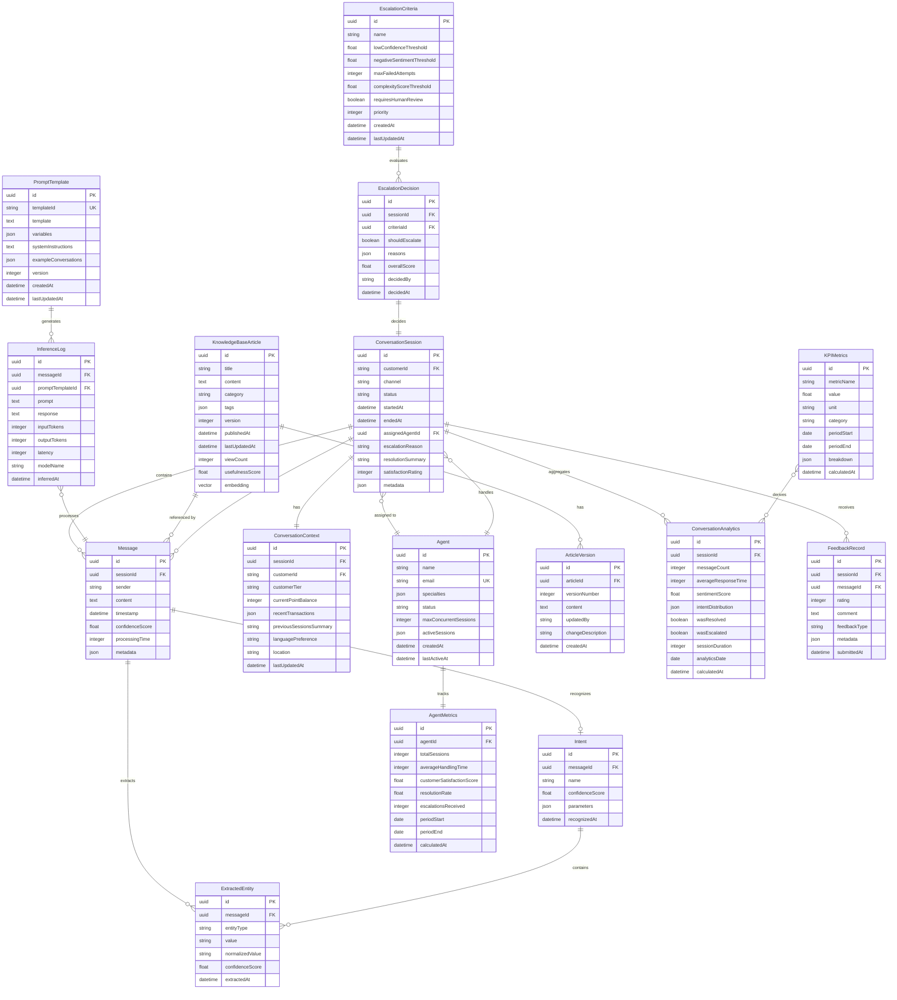

# UC-006: 生成AI搭載カスタマーサポートチャットボット - データモデル設計

## 1. 概要

本ドキュメントは、UC-006「生成AI搭載カスタマーサポートチャットボット」のデータモデル設計を定義します。ドメイン分析とサービス設計に基づき、各エンティティの詳細な構造、関係性、および制約を記載しています。

## 2. 設計原則

### 2.1 マイクロサービスアーキテクチャにおけるデータ所有権
- 各サービスは独自のデータストアを持つ
- データの所有権は明確に定義され、サービス境界を越えた直接的なデータアクセスは行わない
- サービス間のデータ連携はAPI呼び出しまたはイベント駆動で実現

### 2.2 最終的整合性（Eventual Consistency）
- 分散システムにおいて、即時の強整合性よりも可用性を優先
- イベントソーシングとCQRSパターンの活用を検討
- 各サービスは独立してスケールできる設計

### 2.3 データ品質とセキュリティ
- 個人情報保護法（APPI）、GDPR準拠
- データの暗号化（保管時・通信時）
- 監査ログの完全性保証
- データ保持期間の適切な管理

## 3. エンティティ一覧

本ユースケースで管理する主要なエンティティを以下に示します：

### 3.1 会話管理関連エンティティ
1. **ConversationSession（会話セッション）** - 会話の全体的なライフサイクルを管理
2. **Message（メッセージ）** - 会話内の個別のメッセージ
3. **ConversationContext（会話コンテキスト）** - 会話の文脈情報

### 3.2 AI推論関連エンティティ
4. **Intent（インテント）** - 顧客の意図
5. **ExtractedEntity（抽出エンティティ）** - メッセージから抽出された情報要素
6. **PromptTemplate（プロンプトテンプレート）** - LLMへの入力テンプレート
7. **InferenceLog（推論ログ）** - AI推論の実行履歴

### 3.3 知識管理関連エンティティ
8. **KnowledgeBaseArticle（知識ベース記事）** - FAQや製品情報
9. **ArticleVersion（記事バージョン）** - 記事の変更履歴

### 3.4 エージェント管理関連エンティティ
10. **Agent（カスタマーサポートエージェント）** - 人間のオペレーター
11. **AgentMetrics（エージェントメトリクス）** - エージェントのパフォーマンス指標

### 3.5 エスカレーション関連エンティティ
12. **EscalationCriteria（エスカレーション基準）** - エスカレーション判定ルール
13. **EscalationDecision（エスカレーション判定結果）** - 判定の履歴

### 3.6 分析関連エンティティ
14. **ConversationAnalytics（会話分析）** - 会話データの集計
15. **KPIMetrics（KPIメトリクス）** - 主要業績評価指標
16. **FeedbackRecord（フィードバック記録）** - 顧客からの評価

## 4. データモデル図（Mermaid ER図）



## 5. エンティティ詳細仕様

### 5.1 ConversationSession（会話セッション）

**責務**: 顧客とチャットボット間の会話の全体的なライフサイクルを管理

**属性**:
| 属性名 | 型 | 必須 | 説明 | 制約 |
|--------|-----|------|------|------|
| id | UUID | ✓ | セッションの一意識別子 | PK |
| customerId | String | ✓ | 顧客ID（CDPから取得） | FK, Index |
| channel | String | ✓ | チャネル（Web, MobileApp, LINE等） | Enum: Web, MobileApp, LINE, FacebookMessenger |
| status | String | ✓ | セッションステータス | Enum: Active, Resolved, Escalated, Abandoned |
| startedAt | DateTime | ✓ | 会話開始時刻 | Timestamp |
| endedAt | DateTime |   | 会話終了時刻 | Timestamp, Nullable |
| assignedAgentId | UUID |   | 割り当てられたエージェントID | FK, Nullable |
| escalationReason | String |   | エスカレーション理由 | Nullable, Max 500 chars |
| resolutionSummary | String |   | 解決内容サマリー | Nullable, Max 1000 chars |
| satisfactionRating | Integer |   | 満足度評価（1-5） | Range: 1-5, Nullable |
| metadata | JSON |   | その他のメタデータ | Nullable |

**不変条件（Invariants）**:
- `status = 'Escalated'` の場合、`assignedAgentId` は必須
- `status = 'Resolved'` または `'Abandoned'` の場合、`endedAt` は必須
- `satisfactionRating` が設定される場合、`status` は `'Resolved'` である必要がある
- `startedAt` < `endedAt` （終了時刻が設定される場合）

**データ所有サービス**: 会話管理サービス（SVC-006-001）

**ストレージ**: PostgreSQL + Redis（アクティブセッションのキャッシュ）

**保持期間**: 
- アクティブデータ: 90日間
- アーカイブ: 2年間

---

### 5.2 Message（メッセージ）

**責務**: 会話セッション内の個別のメッセージを管理

**属性**:
| 属性名 | 型 | 必須 | 説明 | 制約 |
|--------|-----|------|------|------|
| id | UUID | ✓ | メッセージの一意識別子 | PK |
| sessionId | UUID | ✓ | 所属する会話セッションID | FK, Index |
| sender | String | ✓ | 送信者タイプ | Enum: Customer, Bot, Agent |
| content | Text | ✓ | メッセージ本文 | Max 4000 chars |
| timestamp | DateTime | ✓ | 送信時刻 | Timestamp, Index |
| confidenceScore | Float |   | 応答の信頼度（Botのみ） | Range: 0.0-1.0, Nullable |
| processingTime | Integer |   | 処理時間（ミリ秒） | Positive, Nullable |
| metadata | JSON |   | その他のメタデータ | Nullable |

**不変条件（Invariants）**:
- `sender = 'Bot'` の場合、`confidenceScore` と `processingTime` が設定されるべき
- `timestamp` は所属する `ConversationSession` の `startedAt` 以降である必要がある
- 同一セッション内のメッセージは `timestamp` 順にソート可能

**データ所有サービス**: 会話管理サービス（SVC-006-001）

**ストレージ**: PostgreSQL（時系列データとして最適化）

**保持期間**: 90日間（その後アーカイブ）

---

### 5.3 ConversationContext（会話コンテキスト）

**責務**: 会話の文脈情報を保持し、パーソナライズされた応答を実現

**属性**:
| 属性名 | 型 | 必須 | 説明 | 制約 |
|--------|-----|------|------|------|
| id | UUID | ✓ | コンテキストの一意識別子 | PK |
| sessionId | UUID | ✓ | 対応する会話セッションID | FK, Unique |
| customerId | String | ✓ | 顧客ID | FK |
| customerTier | String | ✓ | 顧客ティア | Enum: Bronze, Silver, Gold, Platinum |
| currentPointBalance | Integer | ✓ | 現在のポイント残高 | Non-negative |
| recentTransactions | JSON |   | 最近の取引サマリー | Nullable, Array of objects |
| previousSessionsSummary | String |   | 過去セッションのサマリー | Nullable, Max 2000 chars |
| languagePreference | String | ✓ | 言語設定 | Default: 'ja', ISO 639-1 code |
| location | String |   | 位置情報 | Nullable |
| lastUpdatedAt | DateTime | ✓ | 最終更新時刻 | Timestamp |

**不変条件（Invariants）**:
- `customerId` は対応する `ConversationSession` の `customerId` と一致する必要がある
- `currentPointBalance` は非負整数

**データ所有サービス**: 会話管理サービス（SVC-006-001）

**ストレージ**: Redis（高速アクセス）、PostgreSQL（永続化）

**保持期間**: セッション期間中 + 30日間

---

### 5.4 Intent（インテント）

**責務**: 顧客メッセージから認識された意図を表現

**属性**:
| 属性名 | 型 | 必須 | 説明 | 制約 |
|--------|-----|------|------|------|
| id | UUID | ✓ | インテントの一意識別子 | PK |
| messageId | UUID | ✓ | 対応するメッセージID | FK |
| name | String | ✓ | インテント名 | Enum: CheckPointBalance, RedeemReward, InquireCampaign, TechnicalSupport, etc. |
| confidenceScore | Float | ✓ | 認識の信頼度 | Range: 0.0-1.0 |
| parameters | JSON |   | インテントのパラメータ | Nullable, Key-value pairs |
| recognizedAt | DateTime | ✓ | 認識時刻 | Timestamp |

**不変条件（Invariants）**:
- `confidenceScore` は 0.0 から 1.0 の範囲
- 一つのメッセージに対して複数のインテントが認識される場合がある

**データ所有サービス**: AI推論サービス（SVC-006-002）

**ストレージ**: PostgreSQL

**保持期間**: 90日間

---

### 5.5 ExtractedEntity（抽出エンティティ）

**責務**: メッセージから抽出された具体的な情報要素

**属性**:
| 属性名 | 型 | 必須 | 説明 | 制約 |
|--------|-----|------|------|------|
| id | UUID | ✓ | エンティティの一意識別子 | PK |
| messageId | UUID | ✓ | 対応するメッセージID | FK |
| entityType | String | ✓ | エンティティタイプ | Enum: Date, Amount, ProductName, PointValue, Location, etc. |
| value | String | ✓ | 抽出された元の値 | Max 500 chars |
| normalizedValue | String |   | 正規化された値 | Nullable, Max 500 chars |
| confidenceScore | Float | ✓ | 抽出の信頼度 | Range: 0.0-1.0 |
| extractedAt | DateTime | ✓ | 抽出時刻 | Timestamp |

**不変条件（Invariants）**:
- `confidenceScore` は 0.0 から 1.0 の範囲
- `normalizedValue` は標準化されたフォーマット（例: 日付は ISO 8601）

**データ所有サービス**: AI推論サービス（SVC-006-002）

**ストレージ**: PostgreSQL

**保持期間**: 90日間

---

### 5.6 PromptTemplate（プロンプトテンプレート）

**責務**: LLMへの入力プロンプトのテンプレートを管理

**属性**:
| 属性名 | 型 | 必須 | 説明 | 制約 |
|--------|-----|------|------|------|
| id | UUID | ✓ | テンプレートの一意識別子 | PK |
| templateId | String | ✓ | テンプレート識別子 | UK, Index |
| template | Text | ✓ | プロンプトテンプレート本文 | Max 10000 chars |
| variables | JSON | ✓ | テンプレート変数リスト | Array of strings |
| systemInstructions | Text | ✓ | システム指示文 | Max 5000 chars |
| exampleConversations | JSON |   | 例示会話（Few-shot learning用） | Nullable, Array of objects |
| version | Integer | ✓ | バージョン番号 | Positive, Default: 1 |
| createdAt | DateTime | ✓ | 作成時刻 | Timestamp |
| lastUpdatedAt | DateTime | ✓ | 最終更新時刻 | Timestamp |

**不変条件（Invariants）**:
- `version` は単調増加
- 同一 `templateId` の複数バージョンが存在可能
- `template` 内の変数プレースホルダーは `variables` に定義された変数名と一致する必要がある

**データ所有サービス**: AI推論サービス（SVC-006-002）

**ストレージ**: PostgreSQL

**保持期間**: 全バージョン永続保持

---

### 5.7 InferenceLog（推論ログ）

**責務**: AI推論の実行履歴とパフォーマンス情報を記録

**属性**:
| 属性名 | 型 | 必須 | 説明 | 制約 |
|--------|-----|------|------|------|
| id | UUID | ✓ | ログの一意識別子 | PK |
| messageId | UUID | ✓ | 対応するメッセージID | FK |
| promptTemplateId | UUID | ✓ | 使用したプロンプトテンプレートID | FK |
| prompt | Text | ✓ | 実際に送信したプロンプト | Max 20000 chars |
| response | Text | ✓ | LLMからの応答 | Max 20000 chars |
| inputTokens | Integer | ✓ | 入力トークン数 | Positive |
| outputTokens | Integer | ✓ | 出力トークン数 | Positive |
| latency | Integer | ✓ | レイテンシ（ミリ秒） | Positive |
| modelName | String | ✓ | 使用したモデル名 | Max 100 chars |
| inferredAt | DateTime | ✓ | 推論実行時刻 | Timestamp |

**不変条件（Invariants）**:
- `inputTokens` と `outputTokens` は正の整数
- `latency` は実測値（0より大きい）

**データ所有サービス**: AI推論サービス（SVC-006-002）

**ストレージ**: PostgreSQL（短期）、Object Storage（長期アーカイブ）

**保持期間**: 
- リアルタイムログ: 30日間
- 分析用ログ: 2年間

---

### 5.8 KnowledgeBaseArticle（知識ベース記事）

**責務**: FAQや製品情報などの知識ベース記事を管理

**属性**:
| 属性名 | 型 | 必須 | 説明 | 制約 |
|--------|-----|------|------|------|
| id | UUID | ✓ | 記事の一意識別子 | PK |
| title | String | ✓ | 記事タイトル | Max 200 chars |
| content | Text | ✓ | 記事本文 | Max 50000 chars |
| category | String | ✓ | カテゴリ | Enum: FAQ, TroubleShooting, Policy, ProductInfo, CampaignInfo |
| tags | JSON | ✓ | タグリスト | Array of strings |
| version | Integer | ✓ | バージョン番号 | Positive, Default: 1 |
| publishedAt | DateTime | ✓ | 公開日時 | Timestamp |
| lastUpdatedAt | DateTime | ✓ | 最終更新日時 | Timestamp |
| viewCount | Integer | ✓ | 閲覧回数 | Non-negative, Default: 0 |
| usefulnessScore | Float | ✓ | 有用性スコア | Range: 0.0-5.0, Default: 0.0 |
| embedding | Vector |   | ベクトル埋め込み（検索用） | Nullable, Dimension: 1536 (OpenAI ada-002) |

**不変条件（Invariants）**:
- `version` は単調増加
- 公開記事は `title` と `content` が必須
- `usefulnessScore` は 0.0 から 5.0 の範囲

**データ所有サービス**: 知識管理サービス（SVC-006-003）

**ストレージ**: PostgreSQL + pgvector（ベクトル検索対応）

**保持期間**: 全バージョン永続保持

---

### 5.9 ArticleVersion（記事バージョン）

**責務**: 知識ベース記事の変更履歴を管理

**属性**:
| 属性名 | 型 | 必須 | 説明 | 制約 |
|--------|-----|------|------|------|
| id | UUID | ✓ | バージョンの一意識別子 | PK |
| articleId | UUID | ✓ | 対応する記事ID | FK |
| versionNumber | Integer | ✓ | バージョン番号 | Positive |
| content | Text | ✓ | この版の本文 | Max 50000 chars |
| updatedBy | String | ✓ | 更新者ID | Max 100 chars |
| changeDescription | String |   | 変更内容の説明 | Nullable, Max 1000 chars |
| createdAt | DateTime | ✓ | 作成時刻 | Timestamp |

**不変条件（Invariants）**:
- 同一 `articleId` の `versionNumber` は一意かつ単調増加
- 最新バージョンは親記事の `version` と一致

**データ所有サービス**: 知識管理サービス（SVC-006-003）

**ストレージ**: PostgreSQL（現行）、Object Storage（旧バージョン）

**保持期間**: 全バージョン永続保持

---

### 5.10 Agent（カスタマーサポートエージェント）

**責務**: 人間のカスタマーサポートオペレーター情報を管理

**属性**:
| 属性名 | 型 | 必須 | 説明 | 制約 |
|--------|-----|------|------|------|
| id | UUID | ✓ | エージェントの一意識別子 | PK |
| name | String | ✓ | エージェント氏名 | Max 100 chars |
| email | String | ✓ | メールアドレス | UK, Email format |
| specialties | JSON | ✓ | 専門分野リスト | Array of strings, Enum: Billing, Technical, General, VIP |
| status | String | ✓ | 現在のステータス | Enum: Available, Busy, Offline, Default: Offline |
| maxConcurrentSessions | Integer | ✓ | 同時対応可能セッション数 | Positive, Default: 5 |
| activeSessions | JSON | ✓ | アクティブなセッションIDリスト | Array of UUID, Default: [] |
| createdAt | DateTime | ✓ | 登録日時 | Timestamp |
| lastActiveAt | DateTime |   | 最終アクティブ日時 | Nullable, Timestamp |

**不変条件（Invariants）**:
- `activeSessions` の要素数 ≤ `maxConcurrentSessions`
- `status = 'Offline'` の場合、`activeSessions` は空配列
- `email` は一意

**データ所有サービス**: エージェント管理サービス（SVC-006-005）

**ストレージ**: PostgreSQL + Redis（リアルタイム状態管理）

**保持期間**: 永続保持

---

### 5.11 AgentMetrics（エージェントメトリクス）

**責務**: エージェントのパフォーマンス指標を追跡

**属性**:
| 属性名 | 型 | 必須 | 説明 | 制約 |
|--------|-----|------|------|------|
| id | UUID | ✓ | メトリクスの一意識別子 | PK |
| agentId | UUID | ✓ | 対応するエージェントID | FK |
| totalSessions | Integer | ✓ | 総対応セッション数 | Non-negative |
| averageHandlingTime | Integer | ✓ | 平均処理時間（秒） | Non-negative |
| customerSatisfactionScore | Float | ✓ | 顧客満足度スコア | Range: 1.0-5.0 |
| resolutionRate | Float | ✓ | 解決率（%） | Range: 0.0-100.0 |
| escalationsReceived | Integer | ✓ | 受信エスカレーション数 | Non-negative |
| periodStart | Date | ✓ | 集計期間開始日 | Date |
| periodEnd | Date | ✓ | 集計期間終了日 | Date |
| calculatedAt | DateTime | ✓ | 計算日時 | Timestamp |

**不変条件（Invariants）**:
- `periodStart` ≤ `periodEnd`
- `resolutionRate` は 0.0 から 100.0 の範囲
- `customerSatisfactionScore` は 1.0 から 5.0 の範囲

**データ所有サービス**: エージェント管理サービス（SVC-006-005）

**ストレージ**: PostgreSQL

**保持期間**: 2年間

---

### 5.12 EscalationCriteria（エスカレーション基準）

**責務**: エスカレーション判定のルールを定義

**属性**:
| 属性名 | 型 | 必須 | 説明 | 制約 |
|--------|-----|------|------|------|
| id | UUID | ✓ | 基準の一意識別子 | PK |
| name | String | ✓ | 基準名 | Max 100 chars |
| lowConfidenceThreshold | Float | ✓ | 低信頼度閾値 | Range: 0.0-1.0, Default: 0.6 |
| negativeSentimentThreshold | Float | ✓ | ネガティブセンチメント閾値 | Range: -1.0-1.0, Default: -0.7 |
| maxFailedAttempts | Integer | ✓ | 最大失敗回数 | Positive, Default: 3 |
| complexityScoreThreshold | Float | ✓ | 複雑度スコア閾値 | Range: 0.0-1.0, Default: 0.8 |
| requiresHumanReview | Boolean | ✓ | 人間レビュー必須フラグ | Default: false |
| priority | Integer | ✓ | 優先度 | Range: 1-10, Default: 5 |
| createdAt | DateTime | ✓ | 作成日時 | Timestamp |
| lastUpdatedAt | DateTime | ✓ | 最終更新日時 | Timestamp |

**不変条件（Invariants）**:
- 各閾値は定義された範囲内
- `priority` は 1（最高）から 10（最低）の範囲

**データ所有サービス**: エスカレーション判定サービス（SVC-006-004）

**ストレージ**: PostgreSQL + Redis（頻繁なアクセスのためキャッシュ）

**保持期間**: 永続保持（監査証跡として）

---

### 5.13 EscalationDecision（エスカレーション判定結果）

**責務**: エスカレーション判定の履歴を記録

**属性**:
| 属性名 | 型 | 必須 | 説明 | 制約 |
|--------|-----|------|------|------|
| id | UUID | ✓ | 判定の一意識別子 | PK |
| sessionId | UUID | ✓ | 対応する会話セッションID | FK |
| criteriaId | UUID | ✓ | 使用した判定基準ID | FK |
| shouldEscalate | Boolean | ✓ | エスカレーション要否 | - |
| reasons | JSON | ✓ | 判定理由リスト | Array of objects |
| overallScore | Float | ✓ | 総合スコア | Range: 0.0-1.0 |
| decidedBy | String | ✓ | 判定者（System/Agent） | Max 100 chars |
| decidedAt | DateTime | ✓ | 判定日時 | Timestamp |

**不変条件（Invariants）**:
- `reasons` には少なくとも1つの理由が含まれる
- `overallScore` は 0.0 から 1.0 の範囲

**データ所有サービス**: エスカレーション判定サービス（SVC-006-004）

**ストレージ**: PostgreSQL

**保持期間**: 2年間（監査証跡として）

---

### 5.14 ConversationAnalytics（会話分析）

**責務**: 会話データの集計・分析結果を保持

**属性**:
| 属性名 | 型 | 必須 | 説明 | 制約 |
|--------|-----|------|------|------|
| id | UUID | ✓ | 分析の一意識別子 | PK |
| sessionId | UUID | ✓ | 対応する会話セッションID | FK, UK |
| messageCount | Integer | ✓ | メッセージ総数 | Positive |
| averageResponseTime | Integer | ✓ | 平均応答時間（秒） | Non-negative |
| sentimentScore | Float | ✓ | 全体的なセンチメントスコア | Range: -1.0-1.0 |
| intentDistribution | JSON | ✓ | インテント分布 | Key-value pairs |
| wasResolved | Boolean | ✓ | 解決済みフラグ | - |
| wasEscalated | Boolean | ✓ | エスカレーションフラグ | - |
| sessionDuration | Integer | ✓ | セッション継続時間（秒） | Positive |
| analyticsDate | Date | ✓ | 分析日 | Date, Index |
| calculatedAt | DateTime | ✓ | 計算日時 | Timestamp |

**不変条件（Invariants）**:
- `messageCount` は正の整数
- `sentimentScore` は -1.0 から 1.0 の範囲
- 一つのセッションに対して一つの分析レコード

**データ所有サービス**: 分析・レポーティングサービス（SVC-006-006）

**ストレージ**: Data Warehouse（Azure Synapse / Snowflake）

**保持期間**: 5年間

---

### 5.15 KPIMetrics（KPIメトリクス）

**責務**: 主要業績評価指標を管理

**属性**:
| 属性名 | 型 | 必須 | 説明 | 制約 |
|--------|-----|------|------|------|
| id | UUID | ✓ | メトリクスの一意識別子 | PK |
| metricName | String | ✓ | メトリクス名 | Enum: AutoResolutionRate, AverageResponseTime, CSAT, NPS, EscalationRate, etc. |
| value | Float | ✓ | メトリクス値 | - |
| unit | String | ✓ | 単位 | Enum: percentage, seconds, count, score |
| category | String | ✓ | カテゴリ | Enum: Performance, Quality, Efficiency, Satisfaction |
| periodStart | Date | ✓ | 集計期間開始日 | Date |
| periodEnd | Date | ✓ | 集計期間終了日 | Date |
| breakdown | JSON |   | 詳細内訳 | Nullable, Key-value pairs |
| calculatedAt | DateTime | ✓ | 計算日時 | Timestamp |

**不変条件（Invariants）**:
- `periodStart` ≤ `periodEnd`
- `value` は `metricName` に応じた妥当な範囲

**データ所有サービス**: 分析・レポーティングサービス（SVC-006-006）

**ストレージ**: Data Warehouse

**保持期間**: 5年間

---

### 5.16 FeedbackRecord（フィードバック記録）

**責務**: 顧客からのフィードバックを記録

**属性**:
| 属性名 | 型 | 必須 | 説明 | 制約 |
|--------|-----|------|------|------|
| id | UUID | ✓ | フィードバックの一意識別子 | PK |
| sessionId | UUID | ✓ | 対応する会話セッションID | FK |
| messageId | UUID |   | 特定のメッセージID（オプション） | Nullable, FK |
| rating | Integer | ✓ | 評価（1-5） | Range: 1-5 |
| comment | Text |   | コメント | Nullable, Max 2000 chars |
| feedbackType | String | ✓ | フィードバックタイプ | Enum: Helpful, NotHelpful, Resolved, NotResolved, Escalation |
| metadata | JSON |   | その他のメタデータ | Nullable |
| submittedAt | DateTime | ✓ | 送信日時 | Timestamp |

**不変条件（Invariants）**:
- `rating` は 1 から 5 の範囲
- 一つのセッションに対して複数のフィードバックが存在可能

**データ所有サービス**: 会話管理サービス（SVC-006-001）、分析サービスが購読

**ストレージ**: PostgreSQL

**保持期間**: 2年間

---

## 6. サービス別データ所有権マトリクス

| エンティティ | 所有サービス | 読み取りアクセス権 |
|-------------|-------------|-------------------|
| ConversationSession | 会話管理サービス（SVC-006-001） | AI推論、エスカレーション判定、エージェント管理、分析 |
| Message | 会話管理サービス（SVC-006-001） | AI推論、エスカレーション判定、分析 |
| ConversationContext | 会話管理サービス（SVC-006-001） | AI推論 |
| Intent | AI推論サービス（SVC-006-002） | 会話管理、エスカレーション判定、分析 |
| ExtractedEntity | AI推論サービス（SVC-006-002） | 会話管理、分析 |
| PromptTemplate | AI推論サービス（SVC-006-002） | - |
| InferenceLog | AI推論サービス（SVC-006-002） | 分析 |
| KnowledgeBaseArticle | 知識管理サービス（SVC-006-003） | AI推論、分析 |
| ArticleVersion | 知識管理サービス（SVC-006-003） | - |
| Agent | エージェント管理サービス（SVC-006-005） | 会話管理、エスカレーション判定 |
| AgentMetrics | エージェント管理サービス（SVC-006-005） | 分析 |
| EscalationCriteria | エスカレーション判定サービス（SVC-006-004） | - |
| EscalationDecision | エスカレーション判定サービス（SVC-006-004） | 会話管理、エージェント管理、分析 |
| ConversationAnalytics | 分析・レポーティングサービス（SVC-006-006） | - |
| KPIMetrics | 分析・レポーティングサービス（SVC-006-006） | - |
| FeedbackRecord | 会話管理サービス（SVC-006-001） | 分析 |

## 7. データフローとイベント駆動アーキテクチャ

### 7.1 主要なイベント

#### 会話セッション関連イベント
```json
{
  "eventType": "ConversationStarted",
  "payload": {
    "sessionId": "uuid",
    "customerId": "string",
    "channel": "string",
    "timestamp": "datetime"
  }
}

{
  "eventType": "MessageReceived",
  "payload": {
    "sessionId": "uuid",
    "messageId": "uuid",
    "sender": "Customer|Bot|Agent",
    "content": "string",
    "timestamp": "datetime"
  }
}

{
  "eventType": "SessionEscalated",
  "payload": {
    "sessionId": "uuid",
    "reason": "string",
    "assignedAgentId": "uuid",
    "timestamp": "datetime"
  }
}

{
  "eventType": "SessionResolved",
  "payload": {
    "sessionId": "uuid",
    "resolutionSummary": "string",
    "satisfactionRating": "integer",
    "timestamp": "datetime"
  }
}
```

#### AI推論関連イベント
```json
{
  "eventType": "IntentRecognized",
  "payload": {
    "sessionId": "uuid",
    "messageId": "uuid",
    "intent": "object",
    "confidenceScore": "float",
    "timestamp": "datetime"
  }
}

{
  "eventType": "ResponseGenerated",
  "payload": {
    "sessionId": "uuid",
    "messageId": "uuid",
    "responseText": "string",
    "processingTime": "integer",
    "tokenUsage": "object",
    "timestamp": "datetime"
  }
}

{
  "eventType": "LowConfidenceDetected",
  "payload": {
    "sessionId": "uuid",
    "messageId": "uuid",
    "confidenceScore": "float",
    "timestamp": "datetime"
  }
}
```

#### エージェント関連イベント
```json
{
  "eventType": "AgentAssigned",
  "payload": {
    "sessionId": "uuid",
    "agentId": "uuid",
    "timestamp": "datetime"
  }
}

{
  "eventType": "AgentStatusChanged",
  "payload": {
    "agentId": "uuid",
    "oldStatus": "string",
    "newStatus": "string",
    "timestamp": "datetime"
  }
}
```

#### フィードバック関連イベント
```json
{
  "eventType": "FeedbackReceived",
  "payload": {
    "sessionId": "uuid",
    "rating": "integer",
    "comment": "string",
    "timestamp": "datetime"
  }
}
```

### 7.2 イベント駆動パターン


## 8. データ整合性戦略

### 8.1 最終的整合性（Eventual Consistency）

マイクロサービスアーキテクチャにおいて、各サービスは独自のデータストアを持つため、即時の強整合性を保証することは困難です。代わりに、最終的整合性を前提とした設計を採用します。

**戦略**:
1. **イベントソーシング**: 状態変更をイベントとして記録し、イベントストリームから各サービスが必要なデータを再構築
2. **CQRS（Command Query Responsibility Segregation）**: コマンド（書き込み）とクエリ（読み取り）のモデルを分離
3. **Saga パターン**: 分散トランザクションを複数のローカルトランザクションとイベントの連鎖で実現

### 8.2 データ同期パターン

#### パターン1: イベント駆動同期
- 上流サービスがイベントを発行
- 下流サービスがイベントを購読し、自サービスのデータストアを更新
- At-least-once配信保証により、冪等性を考慮した実装が必要

#### パターン2: API呼び出し + キャッシュ
- リアルタイム性が求められる場合、同期API呼び出し
- 頻繁にアクセスされるデータはキャッシュ（Redis）
- Circuit Breaker パターンで障害時の影響を局所化

#### パターン3: 定期バッチ同期
- リアルタイム性が不要なデータ（分析、レポート）
- 定期的なバッチジョブでデータを同期
- コスト効率が高い

### 8.3 競合解決戦略

**楽観的ロック（Optimistic Locking）**:
- バージョン番号またはタイムスタンプを使用
- 更新時にバージョンをチェックし、競合を検出
- 例: `EscalationCriteria`, `PromptTemplate`

**悲観的ロック（Pessimistic Locking）**:
- 同時更新が頻繁に発生する場合
- データベースレベルのロック機構を使用
- 例: `Agent` のステータス更新

**Last Write Wins（LWW）**:
- タイムスタンプが最新のものを採用
- 競合が稀で、データ損失が許容される場合
- 例: `AgentMetrics` の更新

## 9. セキュリティとプライバシー

### 9.1 データ暗号化

**保管時の暗号化（Encryption at Rest）**:
- データベース: AES-256暗号化
- Object Storage: サーバーサイド暗号化（SSE）
- 機密フィールド: アプリケーションレベルでの追加暗号化

**通信時の暗号化（Encryption in Transit）**:
- TLS 1.3 以上を使用
- サービス間通信: mTLS（相互TLS認証）

### 9.2 個人情報保護

**個人情報の識別**:
- `customerId`, `email`, `name`, `location`, `content`（メッセージ内容）

**保護措置**:
1. **マスキング**: ログ出力時に個人情報をマスク
2. **匿名化**: 分析データでは個人識別情報を除去
3. **アクセス制御**: RBAC（ロールベースアクセス制御）
4. **データ保持期間**: 法定保持期間経過後に自動削除または匿名化

### 9.3 監査ログ

**記録対象**:
- 全ての CRUD 操作（作成、読み取り、更新、削除）
- エスカレーション判定
- エージェント割り当て
- フィードバック送信

**ログ項目**:
- タイムスタンプ
- ユーザー/サービスID
- 操作種別
- 対象エンティティとID
- 操作結果（成功/失敗）
- IPアドレス

## 10. パフォーマンス最適化

### 10.1 インデックス戦略

**ConversationSession**:
- `(customerId, startedAt)` - 顧客別の会話履歴検索
- `(status, startedAt)` - ステータス別の検索
- `(assignedAgentId, status)` - エージェント別のアクティブセッション検索

**Message**:
- `(sessionId, timestamp)` - セッション内のメッセージ取得（時系列順）
- `(timestamp)` - 時系列検索

**KnowledgeBaseArticle**:
- `(category, publishedAt)` - カテゴリ別検索
- `embedding` - ベクトル検索用インデックス（HNSW / IVFFlat）

**Agent**:
- `(status, specialties)` - 利用可能エージェント検索

### 10.2 キャッシング戦略

**Redis キャッシュ対象**:
1. **アクティブセッション**: TTL 30分（会話進行中のみ）
2. **エージェントステータス**: TTL 5分（リアルタイム性が重要）
3. **プロンプトテンプレート**: TTL 24時間（頻繁に使用、変更少ない）
4. **知識ベース検索結果**: TTL 1時間（頻出質問）
5. **エスカレーション基準**: TTL 1時間（頻繁なアクセス）

**キャッシュ無効化戦略**:
- Write-through: 更新時にキャッシュも同時更新
- Cache-aside: 読み取り時にキャッシュミスならDBから取得しキャッシュに格納
- イベント駆動無効化: 更新イベント受信時にキャッシュを無効化

### 10.3 パーティショニング戦略

**時系列データのパーティショニング**:
- `Message`: 月単位でパーティション（`timestamp`）
- `InferenceLog`: 月単位でパーティション（`inferredAt`）
- `ConversationAnalytics`: 月単位でパーティション（`analyticsDate`）

**水平パーティショニング（シャーディング）**:
- 将来的にデータ量が増大した場合、`customerId` の範囲でシャーディング
- Phase 1では単一データベースで対応

## 11. データ移行とバックアップ

### 11.1 バックアップ戦略

**RPO/RTO設定**:
| データ種別 | RPO | RTO | バックアップ頻度 |
|-----------|-----|-----|----------------|
| 会話セッション | 5分 | 30分 | 継続的（レプリケーション） |
| メッセージ | 5分 | 30分 | 継続的（レプリケーション） |
| 知識ベース | 1時間 | 2時間 | 日次フルバックアップ |
| エージェント情報 | 5分 | 30分 | 日次フルバックアップ |
| 分析データ | 1日 | 4時間 | 日次フルバックアップ |

**バックアップ方法**:
- PostgreSQL: 継続的アーカイブ（WAL） + 日次フルバックアップ
- Redis: RDB + AOF
- Object Storage: ジオレプリケーション

### 11.2 災害復旧（DR）

**マルチリージョン構成**:
- Primary: Japan East
- DR: Japan West
- レプリケーション: 非同期レプリケーション（最終的整合性）

**フェイルオーバー手順**:
1. Primary リージョン障害検知
2. DNS切り替え（自動またはhalf-manual）
3. DR リージョンへのトラフィック誘導
4. データ整合性チェック
5. 復旧確認

## 12. まとめ

本データモデル設計は、UC-006「生成AI搭載カスタマーサポートチャットボット」のマイクロサービスアーキテクチャに基づき、以下の原則に従って設計されています：

### 主要な設計決定事項
1. **データ所有権の明確化**: 各サービスが独自のデータストアを持ち、サービス境界を越えた直接アクセスを禁止
2. **最終的整合性**: イベント駆動アーキテクチャによる非同期データ同期
3. **パフォーマンス最適化**: インデックス、キャッシング、パーティショニングの戦略的活用
4. **セキュリティとプライバシー**: 暗号化、アクセス制御、監査ログの徹底
5. **スケーラビリティ**: 水平スケーリングを考慮した設計

### エンティティ総数
全16エンティティを定義し、それぞれに詳細な属性、制約、データ所有サービスを明示しました。

### 次のステップ
1. 各サービスのデータベーススキーマ実装
2. API仕様の詳細設計（OpenAPI/Swagger）
3. イベントスキーマの詳細定義（Avro/Protobuf）
4. データ移行計画の策定（既存システムからの移行がある場合）
5. パフォーマンステストとチューニング
