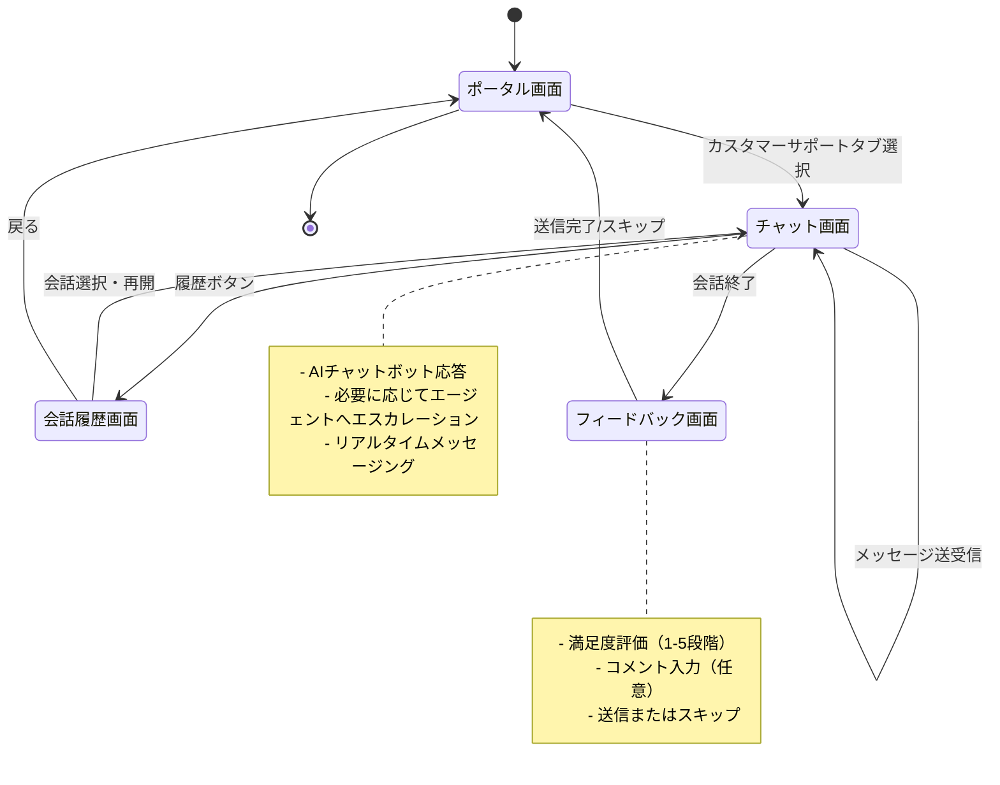
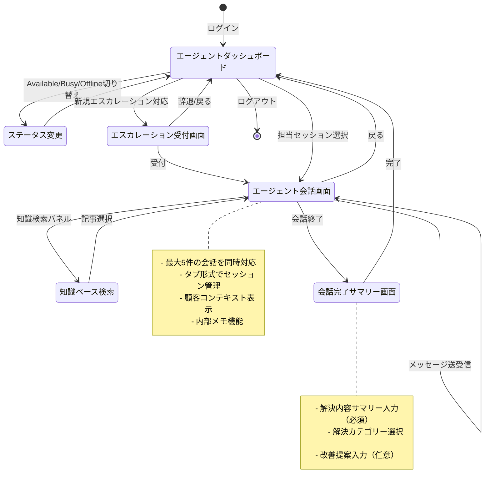
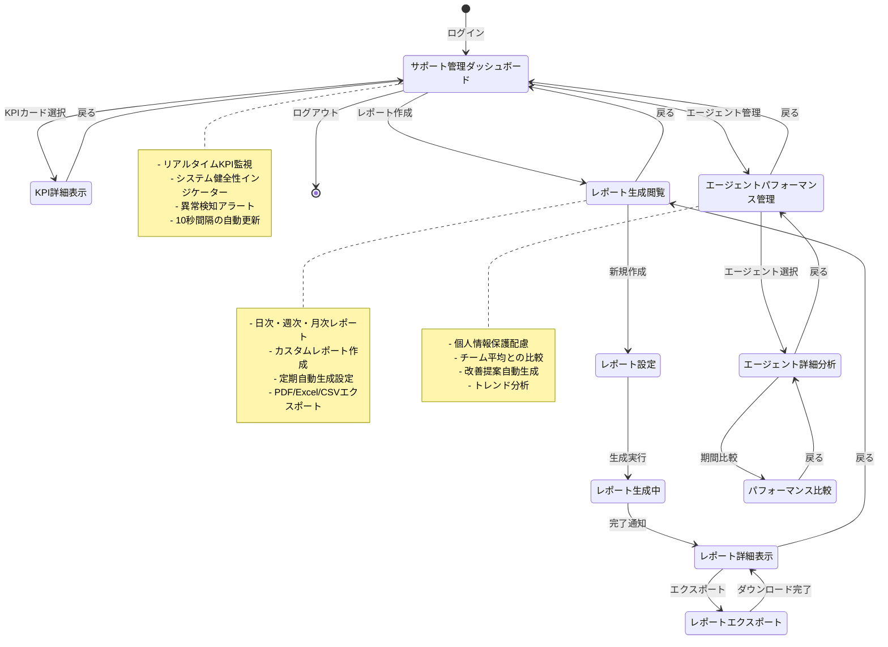
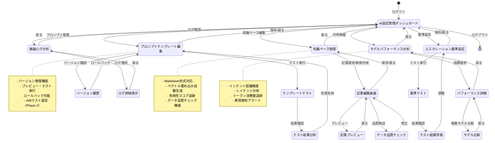
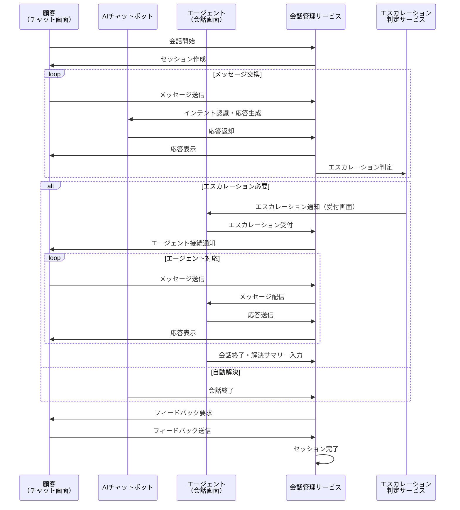
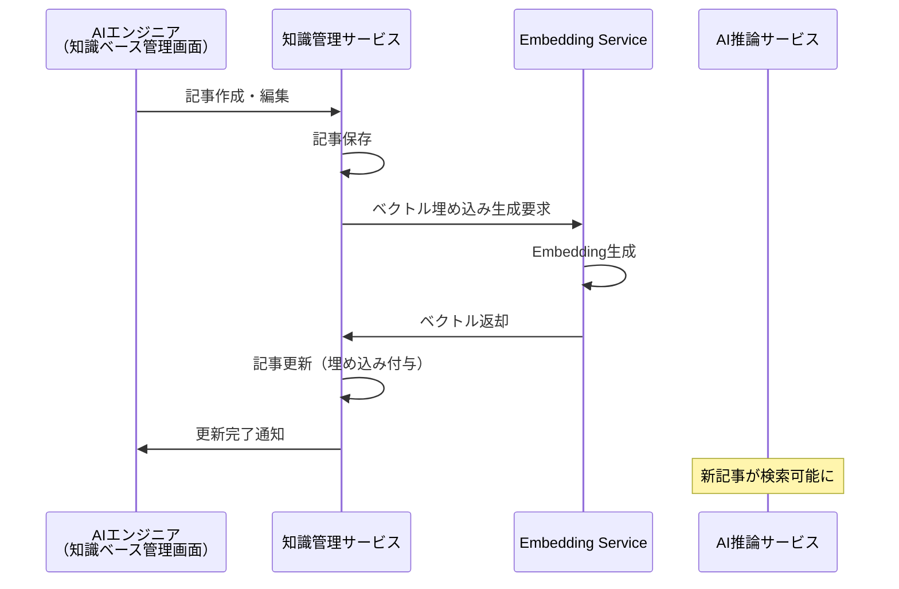
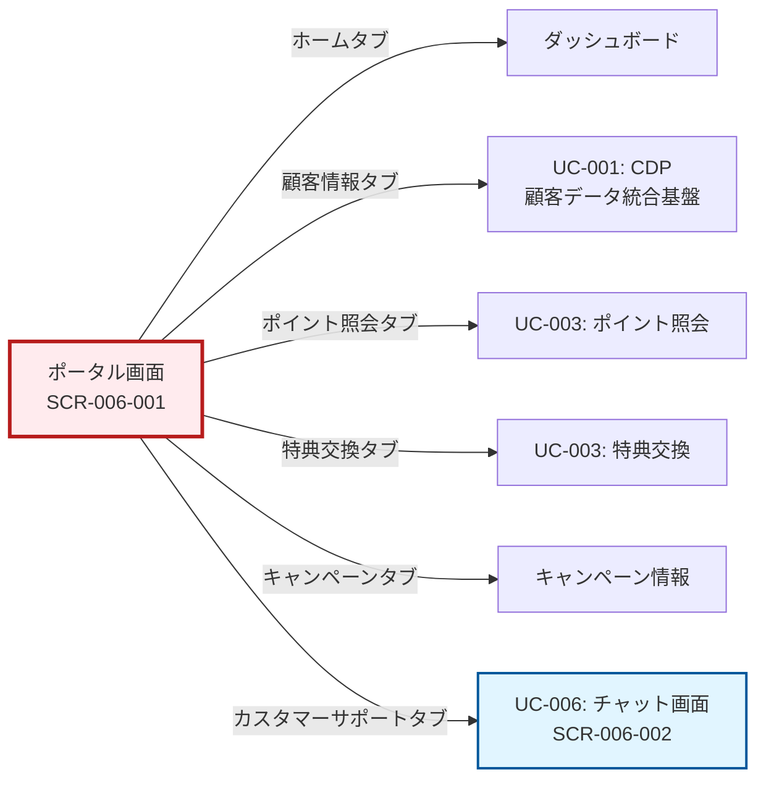
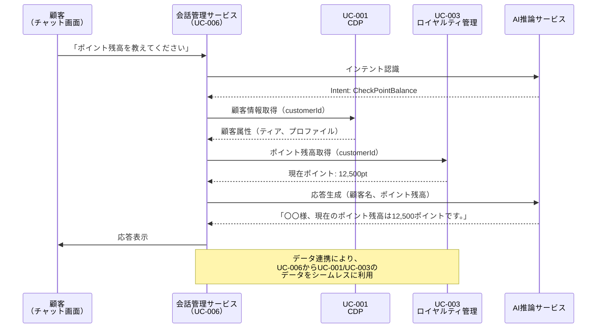

# UC-006: 生成AI搭載カスタマーサポートチャットボット - 画面一覧と画面遷移図

## 1. 概要

本ドキュメントは、UC-006「生成AI搭載カスタマーサポートチャットボット」において、ユーザーが利用する画面の一覧と画面遷移図を定義します。本ユースケースでは、顧客向けのチャットインターフェース、カスタマーサポート担当者向けの管理画面、AIエンジニア向けの設定・監視画面を提供します。

## 2. 画面一覧（Screen List）

### 2.1 顧客向け画面（Customer-Facing Screens）

#### SCR-006-001: ポータル画面
- **screen_id**: SCR-006-001
- **screen_name**: ポータル画面
- **description**: ロイヤルティサービスの全機能へアクセスするための統合ポータル。全ユースケースへタブ形式で切り替え可能。
- **function_type**: ナビゲーション・ダッシュボード
- **主要機能**:
  - タブ形式での各ユースケースへのナビゲーション
  - 顧客情報サマリー表示（氏名、ティア、ポイント残高）
  - 通知・アラート表示
  - クイックアクセスメニュー
- **アクセス権限**: 全顧客
- **備考**: 
  - 画面上部にタブメニューを配置（例：「ホーム」「ポイント照会」「特典交換」「キャンペーン」「カスタマーサポート」など）
  - ユースケースIDは表示せず、各ユースケースの名称を表示
  - レスポンシブデザイン対応（Web、モバイルアプリ、LINE対応）

#### SCR-006-002: チャット画面
- **screen_id**: SCR-006-002
- **screen_name**: カスタマーサポートチャット画面
- **description**: 顧客がAIチャットボットまたは人間エージェントと会話するメイン画面
- **function_type**: 会話インターフェース
- **主要機能**:
  - リアルタイムメッセージ送受信
  - 会話履歴表示
  - テキスト入力フィールド
  - ファイル添付機能（画像、ドキュメント）
  - クイック返信ボタン（よくある質問）
  - 会話状態インジケーター（「入力中...」「AIが考え中...」）
  - 満足度評価ボタン
  - エージェントへのエスカレーション要求ボタン
- **アクセス権限**: 全顧客
- **データ連携**:
  - ConversationSession（会話セッション管理）
  - Message（メッセージ送受信）
  - ConversationContext（顧客コンテキスト）
- **備考**: 
  - 24時間365日利用可能
  - 複数チャネル対応（Web、モバイルアプリ、LINE、Facebook Messenger）
  - 会話内容は暗号化して保存

#### SCR-006-003: 会話履歴画面
- **screen_id**: SCR-006-003
- **screen_name**: 会話履歴一覧画面
- **description**: 過去の会話セッションの一覧を表示し、再確認可能にする画面
- **function_type**: 一覧表示・検索
- **主要機能**:
  - 会話履歴のリスト表示（日付、ステータス、要約）
  - 検索・フィルタリング機能（日付範囲、ステータス、チャネル）
  - ページネーション
  - 個別会話の詳細表示
  - 会話の再開機能
- **アクセス権限**: 全顧客（自分の会話のみ）
- **データ連携**:
  - ConversationSession（会話セッション一覧取得）
  - Message（会話詳細）
- **備考**: 90日間の会話履歴を表示可能

#### SCR-006-004: フィードバック送信画面
- **screen_id**: SCR-006-004
- **screen_name**: フィードバック・評価画面
- **description**: 会話終了後に顧客がフィードバックを送信する画面
- **function_type**: 入力フォーム
- **主要機能**:
  - 満足度評価（1〜5段階）
  - コメント入力（任意）
  - フィードバックタイプ選択（役に立った/役に立たなかった/解決した/解決しなかった）
  - 送信・スキップボタン
- **アクセス権限**: 全顧客
- **データ連携**:
  - FeedbackRecord（フィードバック記録）
- **備考**: 会話終了時にモーダルまたはポップアップで表示

### 2.2 カスタマーサポート担当者向け画面（Agent Screens）

#### SCR-006-005: エージェントダッシュボード
- **screen_id**: SCR-006-005
- **screen_name**: エージェントダッシュボード
- **description**: カスタマーサポート担当者の業務状況とKPIを表示するダッシュボード
- **function_type**: ダッシュボード・モニタリング
- **主要機能**:
  - 自分の稼働状況表示（Available/Busy/Offline）
  - 担当中のセッション一覧
  - 待機中のエスカレーション要求表示
  - 本日のパフォーマンスメトリクス（対応件数、平均処理時間、CSAT）
  - 通知・アラート表示
  - ステータス切り替えボタン
- **アクセス権限**: カスタマーサポート担当者
- **データ連携**:
  - Agent（エージェント情報）
  - AgentMetrics（パフォーマンス指標）
  - ConversationSession（担当セッション）
- **備考**: リアルタイム更新（5秒間隔）

#### SCR-006-006: エージェント会話画面
- **screen_id**: SCR-006-006
- **screen_name**: エージェント会話対応画面
- **description**: エージェントが顧客とリアルタイムで会話するメイン画面
- **function_type**: 会話インターフェース
- **主要機能**:
  - リアルタイムメッセージ送受信
  - 会話履歴表示（エスカレーション前の履歴含む）
  - 顧客コンテキスト表示（顧客情報、ポイント残高、過去の問い合わせ）
  - 知識ベース検索パネル
  - 定型文挿入機能
  - 内部メモ機能
  - 会話終了・解決ボタン
  - 他のエージェントへの転送機能
- **アクセス権限**: カスタマーサポート担当者
- **データ連携**:
  - ConversationSession（会話セッション管理）
  - Message（メッセージ送受信）
  - ConversationContext（顧客コンテキスト）
  - KnowledgeBaseArticle（知識ベース検索）
- **備考**: 
  - マルチセッション対応（最大5件同時）
  - タブ形式で複数会話を管理

#### SCR-006-007: エスカレーション受付画面
- **screen_id**: SCR-006-007
- **screen_name**: エスカレーション要求一覧画面
- **description**: AIからエスカレーションされた会話を受け付ける画面
- **function_type**: 一覧表示・承認
- **主要機能**:
  - エスカレーション要求一覧表示（優先度順）
  - エスカレーション理由表示
  - 顧客情報プレビュー
  - 会話サマリー表示
  - 受付・辞退ボタン
  - フィルタリング機能（専門分野、優先度）
- **アクセス権限**: カスタマーサポート担当者
- **データ連携**:
  - ConversationSession（エスカレーション対象セッション）
  - EscalationDecision（エスカレーション判定結果）
  - Agent（エージェント割り当て）
- **備考**: 
  - リアルタイム通知（新規エスカレーション発生時）
  - SLA時間表示（対応期限）

#### SCR-006-008: 会話完了・解決サマリー画面
- **screen_id**: SCR-006-008
- **screen_name**: 会話完了・解決サマリー入力画面
- **description**: 会話終了時に解決内容を記録する画面
- **function_type**: 入力フォーム
- **主要機能**:
  - 解決内容サマリー入力（必須）
  - 解決カテゴリー選択（FAQ、技術サポート、請求問題など）
  - 使用した知識ベース記事の選択
  - 改善提案入力（任意）
  - 完了ボタン
- **アクセス権限**: カスタマーサポート担当者
- **データ連携**:
  - ConversationSession（解決内容更新）
- **備考**: 会話終了時に必須入力

### 2.3 カスタマーサポート管理者向け画面（Supervisor/Manager Screens）

**対象アクター**: カスタマーサポート管理者（Supervisor/Manager）  
**役割**: チーム全体の監視、パフォーマンス分析、レポート生成、ビジネスルール管理

#### SCR-006-009: サポート管理ダッシュボード
- **screen_id**: SCR-006-009
- **screen_name**: カスタマーサポート管理ダッシュボード
- **description**: チーム全体の稼働状況とKPIを監視するダッシュボード。システム健全性とビジネスKPIをリアルタイムで可視化。
- **function_type**: ダッシュボード・モニタリング
- **主要機能**:
  - リアルタイムKPI表示（自動応答率、平均応答時間、CSAT、エスカレーション率）
  - エージェント稼働状況一覧
  - アクティブセッション数（グラフ表示）
  - 待機中エスカレーション数
  - システム健全性インジケーター（API応答時間、エラー率）
  - 異常検知アラート（閾値超過時の自動通知）
  - 時系列トレンドグラフ
- **アクセス権限**: カスタマーサポート管理者
- **データ連携**:
  - KPIMetrics（主要業績評価指標）
  - ConversationAnalytics（会話分析データ）
  - Agent（エージェント情報）
  - システムヘルスメトリクス（バックエンドサービス）
- **UX考慮事項**:
  - **フィードバック**: KPI変化時のビジュアル通知、異常検知時のアラート音
  - **一貫性**: 全管理画面で統一されたカラースキーム（正常: 緑、警告: 黄、エラー: 赤）
  - **エラー防止**: 重要なアクション（エージェントの強制オフライン等）には確認ダイアログ
- **ビジネスルール対応**:
  - BR-002（パフォーマンス基準）: レスポンスタイム、スループットのリアルタイム監視
  - BR-009（SLA）: 稼働率、対応時間のSLA遵守状況表示
- **備考**: リアルタイム更新（10秒間隔）、モバイルデバイスでも閲覧可能

#### SCR-006-010: レポート生成・閲覧画面
- **screen_id**: SCR-006-010
- **screen_name**: レポート生成・閲覧画面
- **description**: 各種レポートを生成・閲覧する画面。経営層・関連部門へのレポート作成を支援。
- **function_type**: レポート・分析
- **主要機能**:
  - レポート種別選択（日次、週次、月次、カスタム）
  - 期間指定（カレンダーUI）
  - フィルタ条件設定（チャネル、エージェント、カテゴリ）
  - レポート生成ボタン（非同期処理）
  - 生成済みレポート一覧（検索・ソート機能）
  - レポート詳細表示（グラフ、表、サマリー）
  - エクスポート機能（PDF、Excel、CSV）
  - レポートテンプレート管理
  - 定期レポート自動生成設定
- **アクセス権限**: カスタマーサポート管理者
- **データ連携**:
  - ConversationAnalytics（会話分析データ）
  - KPIMetrics（KPI指標）
  - AgentMetrics（エージェントパフォーマンス）
- **UX考慮事項**:
  - **シンプルさ**: ウィザード形式でレポート生成をガイド
  - **フィードバック**: 生成進捗バー、完了時のメール通知
- **ビジネスルール対応**:
  - BR-004（監査とコンプライアンス）: コンプライアンスレポートの定期作成
  - BR-010（継続的改善）: KPIに基づく改善レポート
- **備考**: レポート生成は非同期処理（完了時に通知）、大容量レポートはストリーミングダウンロード

#### SCR-006-011: エージェントパフォーマンス管理画面
- **screen_id**: SCR-006-011
- **screen_name**: エージェントパフォーマンス管理画面
- **description**: 各エージェントのパフォーマンスを詳細に確認・管理する画面。個人情報保護に配慮した表示。
- **function_type**: 一覧表示・分析
- **主要機能**:
  - エージェント一覧表示（匿名化オプション）
  - パフォーマンス指標表示（対応件数、平均処理時間、CSAT、解決率）
  - ソート・フィルタリング機能
  - 個別エージェントの詳細分析
  - 期間比較機能（週次、月次、四半期）
  - トレンドグラフ（折れ線、棒グラフ）
  - チーム平均との比較表示
  - 改善提案自動生成（AI分析）
- **アクセス権限**: カスタマーサポート管理者
- **データ連携**:
  - Agent（エージェント情報）
  - AgentMetrics（パフォーマンス指標）
- **UX考慮事項**:
  - **エラー防止**: パフォーマンス評価時の公平性確保、バイアス防止
  - **一貫性**: レポート画面と同じビジュアルスタイル
- **ビジネスルール対応**:
  - BR-007（ユーザー管理）: エージェントアクセス権のレビュー
- **備考**: プライバシーに配慮した表示、個人情報保護法準拠

### 2.4 AIエンジニア向け画面（AI Engineer Screens）

#### SCR-006-012: AI設定・管理ダッシュボード
- **screen_id**: SCR-006-012
- **screen_name**: AI設定・管理ダッシュボード
- **description**: AIモデルの設定と稼働状況を監視するダッシュボード
- **function_type**: ダッシュボード・設定管理
- **主要機能**:
  - モデル稼働状況表示（利用率、レイテンシ、エラー率）
  - トークン消費量表示（日次、月次）
  - 信頼度スコア分布グラフ
  - インテント認識精度
  - プロンプトテンプレート一覧
  - アラート・通知表示
- **アクセス権限**: AIエンジニア
- **データ連携**:
  - InferenceLog（推論ログ）
  - PromptTemplate（プロンプトテンプレート）
  - Intent（インテント認識結果）
- **備考**: リアルタイム更新（30秒間隔）

#### SCR-006-013: プロンプトテンプレート編集画面
- **screen_id**: SCR-006-013
- **screen_name**: プロンプトテンプレート編集画面
- **description**: LLMへのプロンプトテンプレートを作成・編集する画面
- **function_type**: 入力フォーム・エディタ
- **主要機能**:
  - テンプレートID入力
  - プロンプト本文編集（シンタックスハイライト）
  - 変数定義
  - システム指示文編集
  - 例示会話登録（Few-shot learning用）
  - プレビュー機能
  - テスト実行機能
  - バージョン管理（履歴表示、ロールバック）
  - 保存・公開ボタン
- **アクセス権限**: AIエンジニア
- **データ連携**:
  - PromptTemplate（プロンプトテンプレート管理）
- **備考**: 
  - バージョン管理機能により過去のテンプレートを保持
  - A/Bテスト機能（Phase 2で実装予定）

#### SCR-006-014: 推論ログ分析画面
- **screen_id**: SCR-006-014
- **screen_name**: AI推論ログ分析画面
- **description**: AI推論の詳細ログを分析する画面
- **function_type**: 一覧表示・分析
- **主要機能**:
  - 推論ログ一覧表示
  - フィルタリング機能（日付、信頼度スコア、モデル名）
  - 詳細ログ表示（プロンプト、応答、トークン数、レイテンシ）
  - 検索機能（キーワード検索）
  - 統計情報表示（平均レイテンシ、トークン消費量）
  - エクスポート機能（CSV、JSON）
- **アクセス権限**: AIエンジニア
- **データ連携**:
  - InferenceLog（推論ログ）
- **備考**: 
  - 個人情報はマスキング表示
  - サンプリング表示（全量は表示しない）

#### SCR-006-015: 知識ベース管理画面
- **screen_id**: SCR-006-015
- **screen_name**: 知識ベース管理画面
- **description**: FAQ、製品情報などの知識ベース記事を管理する画面。データ品質チェック機能を搭載。
- **function_type**: 一覧表示・CRUD
- **主要機能**:
  - 記事一覧表示
  - 検索・フィルタリング機能（カテゴリ、タグ、公開状態）
  - 記事の新規作成
  - 記事の編集・削除
  - 記事のプレビュー
  - ベクトル埋め込みの再生成
  - 有用性スコア表示
  - 閲覧回数表示
  - バージョン履歴表示
  - **データ品質チェック機能**（新規追加）:
    - 記事内容の整合性検証
    - リンク切れチェック
    - 重複コンテンツ検出
    - 古い情報の自動検出（最終更新日ベース）
    - 品質スコア表示（0-100点）
- **アクセス権限**: AIエンジニア、コンテンツ管理者
- **データ連携**:
  - KnowledgeBaseArticle（知識ベース記事）
  - ArticleVersion（記事バージョン）
- **UX考慮事項**:
  - **エラー防止**: 保存前の品質チェック、警告表示
  - **フィードバック**: ベクトル埋め込み生成の進捗表示
- **ビジネスルール対応**:
  - BR-008（データ品質）: データ品質チェック機能で実現
- **備考**: 
  - Markdown形式での編集対応
  - 記事更新時に自動でベクトル埋め込み更新
  - データ品質チェックは保存時・定期バッチで実行

#### SCR-006-016: エスカレーション基準設定画面
- **screen_id**: SCR-006-016
- **screen_name**: エスカレーション基準設定画面
- **description**: エスカレーション判定のルールを設定する画面
- **function_type**: 設定画面
- **主要機能**:
  - 基準一覧表示
  - 基準の新規作成・編集
  - 閾値設定（信頼度、センチメント、複雑度）
  - 優先度設定
  - 有効化・無効化切り替え
  - テスト実行機能
  - 変更履歴表示
- **アクセス権限**: AIエンジニア、カスタマーサポート管理者
- **データ連携**:
  - EscalationCriteria（エスカレーション基準）
- **備考**: 
  - 変更は即座に反映（キャッシュ更新）
  - A/Bテスト対応（Phase 2で実装予定）

#### SCR-006-017: モデルパフォーマンス分析画面
- **screen_id**: SCR-006-017
- **screen_name**: AIモデルパフォーマンス分析画面
- **description**: AIモデルの精度とパフォーマンスを詳細に分析する画面
- **function_type**: 分析・可視化
- **主要機能**:
  - インテント認識精度グラフ（時系列）
  - 信頼度スコア分布ヒストグラム
  - エンティティ抽出精度
  - モデル比較機能（GPT-4 vs GPT-3.5など）
  - レイテンシ分析
  - エラー率分析
  - トークン消費量分析
  - 異常検知アラート
- **アクセス権限**: AIエンジニア
- **データ連携**:
  - InferenceLog（推論ログ）
  - Intent（インテント認識結果）
  - ExtractedEntity（抽出エンティティ）
- **備考**: 
  - 日次・週次・月次で切り替え表示
  - データはData Warehouseから取得

## 3. 画面遷移図（Screen Transition Diagram）

### 3.1 全体画面遷移図

```mermaid
graph TB
    %% ポータル画面（全ユースケース統合）
    Portal[SCR-006-001: ポータル画面<br/>タブメニュー]
    
    %% 顧客向け画面
    ChatScreen[SCR-006-002: チャット画面]
    ChatHistory[SCR-006-003: 会話履歴画面]
    Feedback[SCR-006-004: フィードバック画面]
    
    %% エージェント向け画面
    AgentDashboard[SCR-006-005: エージェント<br/>ダッシュボード]
    AgentChat[SCR-006-006: エージェント会話画面]
    EscalationQueue[SCR-006-007: エスカレーション<br/>受付画面]
    ChatComplete[SCR-006-008: 会話完了<br/>サマリー画面]
    
    %% 管理者向け画面
    SupervisorDashboard[SCR-006-009: サポート管理<br/>ダッシュボード]
    ReportScreen[SCR-006-010: レポート<br/>生成・閲覧画面]
    AgentPerformance[SCR-006-011: エージェント<br/>パフォーマンス管理画面]
    
    %% AIエンジニア向け画面
    AIDashboard[SCR-006-012: AI設定・管理<br/>ダッシュボード]
    PromptEditor[SCR-006-013: プロンプト<br/>テンプレート編集画面]
    InferenceLog[SCR-006-014: 推論ログ<br/>分析画面]
    KnowledgeBase[SCR-006-015: 知識ベース<br/>管理画面]
    EscalationSettings[SCR-006-016: エスカレーション<br/>基準設定画面]
    ModelAnalysis[SCR-006-017: モデル<br/>パフォーマンス分析画面]
    
    %% 他のユースケース画面（例）
    UC001[UC-001: 顧客データ統合基盤]
    UC003[UC-003: ロイヤルティ管理]
    OtherUC[その他のユースケース...]
    
    %% ポータルから各画面への遷移（タブ切り替え）
    Portal -->|カスタマーサポートタブ選択| ChatScreen
    Portal -->|タブ切り替え| UC001
    Portal -->|タブ切り替え| UC003
    Portal -->|タブ切り替え| OtherUC
    
    %% 顧客向け画面の遷移
    ChatScreen -->|会話履歴ボタン| ChatHistory
    ChatHistory -->|会話選択| ChatScreen
    ChatScreen -->|会話終了| Feedback
    Feedback -->|送信完了| Portal
    ChatHistory -->|戻る| Portal
    
    %% エージェント向け画面の遷移
    Portal -->|エージェントログイン| AgentDashboard
    AgentDashboard -->|エスカレーション対応| EscalationQueue
    EscalationQueue -->|受付| AgentChat
    AgentDashboard -->|担当セッション選択| AgentChat
    AgentChat -->|会話終了| ChatComplete
    ChatComplete -->|完了| AgentDashboard
    AgentChat -->|戻る| AgentDashboard
    
    %% 管理者向け画面の遷移
    Portal -->|管理者ログイン| SupervisorDashboard
    SupervisorDashboard -->|レポート生成| ReportScreen
    SupervisorDashboard -->|エージェント管理| AgentPerformance
    ReportScreen -->|戻る| SupervisorDashboard
    AgentPerformance -->|戻る| SupervisorDashboard
    
    %% AIエンジニア向け画面の遷移
    Portal -->|AIエンジニアログイン| AIDashboard
    AIDashboard -->|プロンプト管理| PromptEditor
    AIDashboard -->|推論ログ確認| InferenceLog
    AIDashboard -->|知識ベース管理| KnowledgeBase
    AIDashboard -->|エスカレーション設定| EscalationSettings
    AIDashboard -->|パフォーマンス分析| ModelAnalysis
    PromptEditor -->|戻る| AIDashboard
    InferenceLog -->|戻る| AIDashboard
    KnowledgeBase -->|戻る| AIDashboard
    EscalationSettings -->|戻る| AIDashboard
    ModelAnalysis -->|戻る| AIDashboard
    
    %% スタイル定義
    classDef customer fill:#e1f5ff,stroke:#01579b,stroke-width:2px
    classDef agent fill:#fff9c4,stroke:#f57f17,stroke-width:2px
    classDef supervisor fill:#f3e5f5,stroke:#4a148c,stroke-width:2px
    classDef engineer fill:#e8f5e9,stroke:#1b5e20,stroke-width:2px
    classDef portal fill:#ffebee,stroke:#b71c1c,stroke-width:3px
    classDef other fill:#f5f5f5,stroke:#616161,stroke-width:1px
    
    class Portal portal
    class ChatScreen,ChatHistory,Feedback customer
    class AgentDashboard,AgentChat,EscalationQueue,ChatComplete agent
    class SupervisorDashboard,ReportScreen,AgentPerformance supervisor
    class AIDashboard,PromptEditor,InferenceLog,KnowledgeBase,EscalationSettings,ModelAnalysis engineer
    class UC001,UC003,OtherUC other
```

### 3.2 顧客向け画面遷移詳細図

### 3.3 エージェント向け画面遷移詳細図

### 3.4 カスタマーサポート管理者向け画面遷移詳細図

### 3.5 AIエンジニア向け画面遷移詳細図

## 4. 画面間データフロー

### 4.1 会話セッションのライフサイクル

### 4.2 知識ベース更新フロー

## 5. 非機能要件

### 5.1 レスポンシブデザイン

全ての顧客向け画面は以下のデバイスに対応：
- デスクトップ（1920x1080以上）
- タブレット（768x1024）
- スマートフォン（375x667）
- LINE（WebView）

### 5.2 アクセシビリティ

WCAG 2.1 レベルAA準拠：
- キーボード操作対応
- スクリーンリーダー対応
- 色覚異常対応（コントラスト比4.5:1以上）
- フォントサイズ変更対応

### 5.3 パフォーマンス

- 初回ページロード: 3秒以内
- メッセージ送信応答: 5秒以内（P95）
- リアルタイム更新遅延: 1秒以内

### 5.4 セキュリティ

- 通信暗号化（TLS 1.3）
- CSRF対策
- XSS対策
- セッション管理（タイムアウト30分）
- 個人情報マスキング（ログ出力時）

## 6. エラーハンドリング

### 6.1 エラーシナリオ

| シナリオ | 画面表示 | ユーザーアクション |
|---------|---------|------------------|
| ネットワーク接続エラー | 「接続が切断されました。再接続中...」 | 自動再接続、手動リトライボタン |
| AI推論タイムアウト | 「応答に時間がかかっています。エージェントに接続しますか?」 | エスカレーション選択 |
| セッション有効期限切れ | 「セッションが期限切れです。再ログインしてください。」 | ログイン画面へ遷移 |
| サーバーエラー | 「一時的な問題が発生しました。しばらくしてから再度お試しください。」 | リトライボタン |
| 権限エラー | 「この操作を実行する権限がありません。」 | 前の画面に戻る |

### 6.2 フォールバック機能

- AI推論サービス障害時: 事前定義応答テンプレートで対応
- エージェント全員Busy時: 待機キュー表示、推定待ち時間通知
- 知識ベース検索障害時: キャッシュデータで対応

## 7. ビジネスルールと画面機能の対応

本セクションでは、ユースケース定義に記載されたビジネスルール（BR-001〜BR-010）が各画面でどのように実現されているかを明示します。

| ビジネスルール | 画面機能での実現 | 対応画面 |
|-------------|---------------|---------|
| **BR-001: データガバナンス** | - アクセス権限によるデータ制御 - 個人情報のマスキング表示 - 最小権限の原則に基づくロール設計 | 全画面（RBACによる制御） |
| **BR-002: パフォーマンス基準** | - レスポンスタイムの監視（P95 < 5秒） - システム健全性インジケーター - パフォーマンスアラート機能 | SCR-006-009（管理ダッシュボード） SCR-006-017（モデルパフォーマンス分析） |
| **BR-003: セキュリティ要件** | - TLS 1.3による通信暗号化 - CSRF/XSS対策 - セッション管理（30分タイムアウト） - ログ出力時の個人情報マスキング | 非機能要件（5.4）で実装 |
| **BR-004: 監査とコンプライアンス** | - 全操作の監査ログ記録 - コンプライアンスレポート生成 - 監査ログ閲覧機能（Phase 2で追加予定） | SCR-006-010（レポート生成） ※監査ログ閲覧画面はPhase 2 |
| **BR-005: 変更管理** | - プロンプトテンプレートのバージョン管理 - 変更履歴の記録・表示 - ロールバック機能 | SCR-006-013（プロンプト編集） SCR-006-016（エスカレーション基準設定） |
| **BR-006: 災害復旧** | - RTO/RPO設定（データモデル定義に記載） - システム健全性監視 - 自動フェイルオーバー（インフラレベルで実装） | SCR-006-009（管理ダッシュボード） ※DR操作画面はPhase 2検討 |
| **BR-007: ユーザー管理** | - エージェントアクセス権のレビュー - パフォーマンス管理 - ステータス管理（Available/Busy/Offline） | SCR-006-005（エージェントダッシュボード） SCR-006-011（パフォーマンス管理） |
| **BR-008: データ品質** | - 知識ベース記事の品質チェック - データ整合性検証 - 有用性スコア追跡 | SCR-006-015（知識ベース管理） ※データ品質チェック機能を明記 |
| **BR-009: SLA** | - 稼働率・パフォーマンス・対応時間の表示 - SLA遵守状況の監視 - SLA違反時のアラート | SCR-006-009（管理ダッシュボード） |
| **BR-010: 継続的改善** | - KPIに基づく改善レポート - フィードバック収集・分析 - A/Bテスト機能（Phase 2） | SCR-006-004（フィードバック） SCR-006-010（レポート生成） SCR-006-013（プロンプト編集） |

**注記**:
- BR-003（セキュリティ）とBR-006（災害復旧）の一部機能は、画面レベルではなくインフラストラクチャレベルで実装されます。
- BR-004の監査ログ閲覧画面は、Phase 2での追加を推奨します（セキュリティインシデント対応として）。
- 全てのビジネスルールは、バックエンドサービス層でも実装され、画面はその可視化・操作インターフェースとして機能します。

## 8. 例外フローと画面対応

ユースケース定義の例外フロー（E1〜E4）に対する画面での対応状況：

| 例外フロー | 画面での対応 | 対応画面 | 備考 |
|----------|-----------|---------|------|
| **E1: システム障害** | - エラーハンドリング（6.1） - システム健全性監視 - 異常検知アラート | SCR-006-009（管理ダッシュボード） 全画面（エラー表示） | Phase 2で「システム障害管理画面」追加検討 |
| **E2: パフォーマンス劣化** | - リアルタイムパフォーマンス監視 - レイテンシ分析 - ボトルネック特定 | SCR-006-017（モデルパフォーマンス分析） SCR-006-009（管理ダッシュボード） | アラート閾値設定機能を含む |
| **E3: セキュリティインシデント** | - 現状は専門システム（SIEM等）に委譲 - 監査ログ記録（全操作） | ※専門システムで対応 | SIEMとの連携はインフラ設計で検討 |
| **E4: データ品質問題** | - 知識ベース記事の品質チェック - データ整合性検証 - 異常値検出 | SCR-006-015（知識ベース管理） | データ品質チェック機能を追加明記 |

**追加対応事項**:
- **E1（システム障害）**: Phase 2で「システム健全性監視画面」を追加し、障害復旧操作（手動フェイルオーバー、ロールバック等）を実装検討
- **E3（セキュリティインシデント）**: セキュリティインシデント対応は専門システム（SIEM、SOC）で実施。本画面設計では監査ログ記録（BR-004）により証跡を確保
- 全例外フローは、エラーハンドリング（セクション6）でユーザー向けのメッセージとアクションを定義済み

## 9. 関連ユースケースとの統合

ユースケース定義の「15. 関連ユースケース」に基づく、他ユースケースとの画面統合：

### 9.1 ポータル画面でのタブ統合

ポータル画面（SCR-006-001）は、以下の他ユースケースへタブ形式で遷移可能：

### 9.2 他ユースケースとのデータ連携シーケンス

**統合のポイント**:
- ポータル画面は全ユースケースの統合エントリーポイント
- チャット画面（SCR-006-002）は、他ユースケースのデータをAPI経由で取得し、会話コンテキストとして活用
- ユースケースIDは画面に表示せず、「ポイント照会」「特典交換」などのユーザーフレンドリーな名称を使用
- データ連携は同期API（リアルタイム性が必要）と非同期イベント（疎結合）を使い分け

## 10. 備考・注意事項

### 10.1 資料から判断できた点

- UC-006のユースケース説明から、顧客、カスタマーサポート担当者、カスタマーサポート管理者、AIエンジニアの4つのアクター向けの画面が必要であることが明確
- サービス一覧（service-list.md）から、各画面が連携する6つのバックエンドサービスが特定可能
- データモデル（data-model.md）から、各画面で表示・編集する16のエンティティとデータ項目が明確
- ビジネスルール（BR-001〜BR-010）から、セキュリティ、監査、パフォーマンス、品質管理の要件が明確
- UI/UX要件から、レスポンシブデザイン、アクセシビリティ、シンプルさ、一貫性の原則が明確

### 10.2 資料から判断できなかった点（仮定を含む）

- **ポータル画面の具体的なタブ構成**: 他のユースケース（UC-001〜UC-016）の詳細が不明なため、タブ名は仮定
  - 仮定: 「ホーム」「ポイント照会」「特典交換」「キャンペーン」「カスタマーサポート」などの一般的な名称を使用
- **画面の具体的なレイアウト**: UIモックアップが存在しないため、一般的なベストプラクティスに基づいて機能を定義
- **詳細なワークフロー**: 一部の例外フローや承認フローの詳細は不明なため、標準的なフローを仮定
- **多言語対応**: ユースケース説明に「言語設定」の記載があるが、対応言語数や切り替え方法の詳細は不明
- **基本フローの解釈**: ユースケースの基本フロー（計画→設計→開発→テスト→デプロイ→運用）は「システム開発のライフサイクル」を指しており、エンドユーザー向けの画面設計とは視点が異なる
  - 対応: AIエンジニア向け画面にテスト実行、パフォーマンス分析などの開発・運用視点を反映
- **セキュリティインシデント対応**: 例外フローE3の具体的な対応画面は、専門システム（SIEM等）に委ねる方針

### 10.3 今後の検討事項

1. **UIデザイン**: 具体的なモックアップ・プロトタイプの作成（Figmaでのデザインシステム構築）
2. **ユーザビリティテスト**: 各画面の使いやすさの検証（ユーザーインタビュー、A/Bテスト）
3. **A/Bテスト**: プロンプトテンプレート、エスカレーション基準の最適化（Phase 2）
4. **国際化（i18n）**: 多言語対応の詳細仕様策定（対応言語、翻訳管理、RTL対応）
5. **統合ポータル**: 他のユースケース画面との統合設計（共通コンポーネント、デザインシステム）
6. **監査ログ閲覧画面**: BR-004対応として、Phase 2での追加実装検討
7. **システム健全性監視画面**: 例外フローE1対応として、Phase 2での追加実装検討
8. **デプロイメント管理画面**: AIモデルのバージョン管理、A/Bテスト設定（Phase 2）

### 10.4 Phase 1での実装範囲

### 10.4 Phase 1での実装範囲

Phase 1（MVP）では以下の画面を優先実装：
- **顧客向け**: SCR-006-001（ポータル）、SCR-006-002（チャット）、SCR-006-004（フィードバック）
- **エージェント向け**: SCR-006-005（ダッシュボード）、SCR-006-006（会話）、SCR-006-007（エスカレーション受付）
- **AIエンジニア向け**: SCR-006-012（ダッシュボード）、SCR-006-013（プロンプト編集）、SCR-006-015（知識ベース管理）

Phase 2以降で以下を実装：
- **管理者向け全画面**（レポート、パフォーマンス管理）
- **AIエンジニア向け高度な分析画面**（推論ログ分析、モデルパフォーマンス分析）
- **監査ログ閲覧画面**（BR-004対応）
- **システム健全性監視画面**（例外フローE1対応）
- **デプロイメント管理画面**（AIモデルバージョン管理、A/Bテスト）

## 11. 参考資料

- docs/usecase/UC-006/usecase-description.md: ユースケース詳細説明
- docs/usecase/UC-006/services/service-list.md: マイクロサービス一覧
- docs/usecase/UC-006/data-model.md: データモデル設計

## 12. 変更履歴

| 日付 | バージョン | 変更内容 | 作成者 |
|------|----------|---------|--------|
| 2025-10-22 | 1.0 | 初版作成 | GitHub Copilot |
| 2025-10-22 | 1.1 | 妥当性検証に基づく改善版 - アクター「カスタマーサポート管理者」の明確化 - 管理者向け画面にUX考慮事項とビジネスルール対応を追記 - セクション7追加: ビジネスルールと画面機能の対応表 - セクション8追加: 例外フローと画面対応 - セクション9追加: 関連ユースケースとの統合 - 管理者向け詳細遷移図（3.4）追加 - AIエンジニア向け遷移図（3.5）を詳細化 - 知識ベース管理画面（SCR-006-015）にデータ品質チェック機能を追加 - 備考セクションを大幅拡充（基本フロー解釈、セキュリティインシデント対応方針を明記） | GitHub Copilot |
