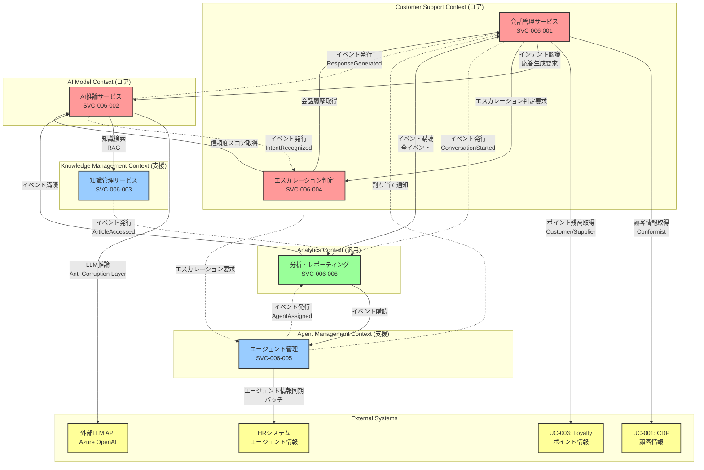

# UC-006: 生成AI搭載カスタマーサポートチャットボット - マイクロサービス候補一覧

## 概要

このドキュメントは、UC-006「生成AI搭載カスタマーサポートチャットボット」のドメイン分析に基づき、マイクロサービスアーキテクチャとして実装するためのサービス候補をリストアップしたものです。各サービスは単一責任の原則（SRP）に基づいて分割され、独立してデプロイ可能で、他サービスと疎結合な設計を目指しています。

---

## サービス候補一覧

### SVC-006-001: 会話管理サービス (Conversation Management Service)

**ステータス**: 候補  
**BC**: Customer Support Context / **サブドメイン**: コア  
**対応UC**: UC-006  

**一次責務（SRP）**:
- 顧客とチャットボット間の会話セッションのライフサイクル管理
- メッセージの受信・保存・履歴管理
- 会話コンテキストの構築と維持
- 会話状態遷移の管理（Active → Resolved/Escalated/Abandoned）

**非責務（明示）**: 
- AIによるインテント認識や応答生成は担当しない（AI推論サービスの責務）
- エージェントへのルーティングは担当しない（エージェント管理サービスの責務）
- 知識ベースの検索は担当しない（知識管理サービスの責務）

#### ドメインモデル
- **アグリゲート/エンティティ**: ConversationSession, Message, ConversationContext
- **発行イベント**: ConversationStarted, MessageReceived, SessionResolved, SessionEscalated, SessionAbandoned
- **購読イベント**: ResponseGenerated, AgentAssigned, IntentRecognized
- **不変条件/制約**: 
  - セッションのステータス遷移は定義された状態遷移図に従う
  - Active状態のセッションのみ新規メッセージを追加可能
  - Escalated状態のセッションはassignedAgentIdが必須
  - メッセージは時系列順に保持
  - 同一セッション内でcustomerIdは一貫

#### データ所有・ストレージ
- **所有データ境界**: 
  - ConversationSession（id, customerId, channel, status, timestamps）
  - Message（id, sessionId, sender, content, timestamp）
  - ConversationContext（顧客情報サマリー、会話履歴）
- **データ分類/機密度**: 社内/機微（個人の問い合わせ内容を含む）、APPI対応必須
- **読み書き特性**: R:W=3:1、時系列追記型（メッセージ）、更新型（セッションステータス）
- **ストレージ選択/理由**: 
  - PostgreSQL（トランザクション整合性、リレーショナルクエリ）
  - Redis（アクティブセッションのキャッシュ、高速読み取り）
- **保持/アーカイブ**: 
  - アクティブデータ: 90日間
  - アーカイブ: 2年間（コールドストレージ）
  - 個人情報: 法定保持期間後に匿名化
- **RPO/RTO**: 5分/30分

#### インターフェース/契約
- **同期API**: 
  - `POST /conversations` - 新規会話セッション開始
  - `GET /conversations/{sessionId}` - セッション詳細取得
  - `POST /conversations/{sessionId}/messages` - メッセージ送信
  - `GET /conversations/{sessionId}/messages` - メッセージ履歴取得
  - `PATCH /conversations/{sessionId}/status` - セッション状態更新
  - `GET /conversations/customer/{customerId}` - 顧客の会話履歴取得
- **非同期契約**: 
  - トピック: `conversations.started`, `conversations.message-received`, `conversations.resolved`, `conversations.escalated`
  - スキーマ: Avro/Protobuf（バージョン管理）
- **契約版管理/互換方針**: 後方互換性維持（新フィールド追加時はoptional）
- **Idempotency/整合性**: メッセージIDによる冪等性保証、楽観的ロックでセッション更新の競合回避

#### サービス間インタラクション
- **下流依存**: 
  - Customer Context（顧客情報取得）- 同期API
  - Loyalty Context（ポイント残高取得）- 同期API
- **上流依存**: 
  - AI推論サービス（インテント認識、応答生成要求）
  - エージェント管理サービス（エスカレーション時）
- **通信方式（理由）**: 
  - 同期: 顧客/ロイヤルティ情報取得（即座に必要なコンテキスト）
  - 非同期: イベント発行（疎結合、スケーラビリティ）
- **コンテキストマップ関係**: 
  - Customer Context: Conformist（顧客情報の標準化されたAPI利用）
  - AI推論サービス: Customer/Supplier

#### 非機能
- **SLO/SLI**: 
  - 可用性: 99.9%
  - レスポンス時間: P95 < 500ms（API）
  - スループット: 1000 req/sec
- **スケール特性**: 水平スケーリング、年末・キャンペーン時2x〜3x
- **耐障害性**: 
  - Circuit Breaker（外部API呼び出し）
  - Retry with Exponential Backoff（一時的エラー）
  - Timeout: 3秒（同期API）
- **可観測性**: 
  - メトリクス: アクティブセッション数、メッセージ数、エラー率
  - ログ: 構造化ログ（JSON）、相関ID
  - トレース: 分散トレーシング（OpenTelemetry）

#### セキュリティ/コンプライアンス
- **認証/認可**: 
  - OAuth 2.0 + OIDC（顧客認証）
  - RBAC（エージェントアクセス制御）
- **データ保護**: 
  - At-rest暗号化（AES-256）
  - In-transit暗号化（TLS 1.3）
  - 個人情報のマスキング（ログ出力時）
- **監査/規制**: APPI準拠、全操作の監査ログ記録

#### 実装/デプロイ/運用
- **技術スタック**: 
  - 言語: Java/Kotlin（Spring Boot）または TypeScript（NestJS）
  - ランタイム: JVM 17+ / Node.js 20+
- **デプロイ単位**: Kubernetes（Deployment + Service）
- **リージョン/DR**: 
  - Primary: Japan East
  - DR: Japan West（Active-Passive）
- **リリース戦略**: Blue/Green Deployment
- **Runbook**: TBD（運用手順書のURL）

#### 意思決定
- **ビジネス価値**: 
  - 定性的: 24時間365日のカスタマーサポート基盤
  - 定量的: サポートコスト30%削減（人的リソース削減）
- **リスク/不確実性**: 
  - 高負荷時のパフォーマンス劣化（緩和策: キャッシング、スケーリング）
  - データ整合性の課題（緩和策: トランザクション境界の明確化）
- **規模見積**: 
  - 開発: 8人週（2名×4週）
  - テスト: 4人週
  - リードタイム: 6週間
- **優先度スコア（式/値）**: 価値(8)×2 + 緊急度(7) + 依存解消(2)×1.5 = 26
- **代替案 / Split-Merge**: 
  - 代替案1: セッションとメッセージを別サービスに分割（過度な分割のため却下）
  - 代替案2: SaaS活用（Twilio Flex等）→ カスタマイズ要件が多いため自社開発を選択

#### 決定ログ & 未決
- **重要な決定**: 
  - ADR-001: PostgreSQL + Redisのハイブリッドストレージ採用
  - ADR-002: イベント駆動アーキテクチャの採用
- **仮説/前提**: 
  - 同時接続ユーザー数は最大10,000
  - 平均会話セッション時間は10分
- **未解決事項（オーナー/期日）**: 
  - セッションタイムアウト時間の最適値決定（@ProductManager / 2週間後）
  - メッセージの暗号化方式詳細（@SecurityTeam / 1週間後）
- **次アクション**: 
  - API仕様書の詳細設計
  - データベーススキーマ設計
  - イベントスキーマ定義

---

### SVC-006-002: AI推論サービス (AI Inference Service)

**ステータス**: 候補  
**BC**: AI Model Context / **サブドメイン**: コア  
**対応UC**: UC-006  

**一次責務（SRP）**:
- 顧客メッセージからのインテント認識
- LLMを使用した応答テキストの生成
- センチメント分析の実行
- 信頼度スコアの算出
- プロンプトテンプレートの管理と実行

**非責務（明示）**: 
- 会話セッションの管理は担当しない（会話管理サービスの責務）
- 知識ベースの検索・管理は担当しない（知識管理サービスの責務）
- エージェントへのルーティングは担当しない（エージェント管理サービスの責務）

#### ドメインモデル
- **アグリゲート/エンティティ**: PromptTemplate, ModelMetrics, InferenceRequest
- **発行イベント**: IntentRecognized, ResponseGenerated, SentimentAnalyzed, LowConfidenceDetected
- **購読イベント**: MessageReceived
- **不変条件/制約**: 
  - プロンプトテンプレートは常にバージョン管理される
  - 信頼度スコアは0.0〜1.0の範囲
  - トークン消費量が上限を超えないこと

#### データ所有・ストレージ
- **所有データ境界**: 
  - PromptTemplate（templateId, template, variables, systemInstructions）
  - InferenceLog（requestId, prompt, response, tokenUsage, latency）
  - ModelConfiguration（modelName, parameters, endpoint）
- **データ分類/機密度**: 社内/機微（プロンプトに顧客情報が含まれる可能性）
- **読み書き特性**: R:W=10:1（推論リクエストが大半）、リアルタイム処理
- **ストレージ選択/理由**: 
  - PostgreSQL（プロンプトテンプレート管理）
  - Redis（頻出質問の応答キャッシュ）
  - Object Storage（推論ログの長期保存）
- **保持/アーカイブ**: 
  - リアルタイムログ: 30日間
  - 分析用ログ: 2年間（コールドストレージ）
- **RPO/RTO**: 15分/1時間（キャッシュ再構築が必要）

#### インターフェース/契約
- **同期API**: 
  - `POST /inference/intent` - インテント認識
  - `POST /inference/response` - 応答生成
  - `POST /inference/sentiment` - センチメント分析
  - `GET /prompts/{templateId}` - プロンプトテンプレート取得
  - `PUT /prompts/{templateId}` - プロンプトテンプレート更新
- **非同期契約**: 
  - トピック: `ai.intent-recognized`, `ai.response-generated`, `ai.low-confidence`
  - スキーマ: Avro（バージョン管理）
- **契約版管理/互換方針**: APIバージョニング（v1, v2）、後方互換性維持
- **Idempotency/整合性**: リクエストIDによる冪等性保証、同一リクエストはキャッシュから返却

#### サービス間インタラクション
- **下流依存**: 
  - Azure OpenAI / AWS Bedrock（LLM API）- Anti-Corruption Layer経由
  - 知識管理サービス（RAG用の知識検索）- 非同期
- **上流依存**: 
  - 会話管理サービス（推論リクエスト受信）
  - エスカレーション判定サービス（信頼度スコア提供）
- **通信方式（理由）**: 
  - 同期: LLM API呼び出し（即座に応答が必要）
  - 非同期: イベント発行（疎結合）
- **コンテキストマップ関係**: 
  - 外部LLM API: Published Language（Anti-Corruption Layerで差異吸収）

#### 非機能
- **SLO/SLI**: 
  - 可用性: 99.5%（外部API依存のため若干低め）
  - レスポンス時間: P95 < 5秒（LLM推論時間含む）
  - スループット: 500 req/sec
  - トークン消費量: 月間1億トークン以内
- **スケール特性**: 水平スケーリング、非同期処理によるキューイング
- **耐障害性**: 
  - Circuit Breaker（外部LLM API）
  - Fallback機能（事前定義応答テンプレート）
  - Retry with Exponential Backoff（レート制限対応）
  - Timeout: 10秒
- **可観測性**: 
  - メトリクス: 推論リクエスト数、レイテンシ、トークン消費量、エラー率
  - ログ: プロンプト/応答ペア（サンプリング）
  - トレース: LLM API呼び出しのトレーシング

#### セキュリティ/コンプライアンス
- **認証/認可**: 
  - サービス間認証（mTLS）
  - APIキー管理（Azure Key Vault）
- **データ保護**: 
  - プロンプト内の個人情報マスキング
  - LLM APIへの送信データの暗号化
  - 応答のサニタイゼーション（機密情報漏洩防止）
- **監査/規制**: 
  - AI倫理ガイドライン準拠
  - バイアス検出・緩和の継続的評価
  - 全推論リクエストの監査ログ

#### 実装/デプロイ/運用
- **技術スタック**: 
  - 言語: Python 3.11+（AI/MLライブラリの豊富さ）
  - フレームワーク: FastAPI（高性能非同期処理）
  - ランタイム: Python async/await
- **デプロイ単位**: Kubernetes（Deployment + HPA）
- **リージョン/DR**: 
  - Primary: Japan East（Azure OpenAI利用可能リージョン）
  - DR: West US（フェイルオーバー用）
- **リリース戦略**: Canary Deployment（段階的ロールアウト）
- **Runbook**: TBD

#### 意思決定
- **ビジネス価値**: 
  - 定性的: 高度な自然言語理解による顧客満足度向上
  - 定量的: 自動応答率60%達成、人的対応時間50%削減
- **リスク/不確実性**: 
  - LLM APIのコスト変動（緩和策: トークン消費量監視、上限設定）
  - 応答品質のばらつき（緩和策: プロンプトエンジニアリング、A/Bテスト）
  - 外部API障害（緩和策: マルチプロバイダー対応、Fallback）
- **規模見積**: 
  - 開発: 12人週（3名×4週）
  - プロンプト最適化: 継続的（2名専任）
  - リードタイム: 8週間
- **優先度スコア（式/値）**: 価値(9)×2 + 緊急度(8) + 依存解消(3)×1.5 = 30.5
- **代替案 / Split-Merge**: 
  - 代替案1: Dialogflow等の既製NLUサービス利用→ カスタマイズ性が低いため却下
  - 代替案2: インテント認識と応答生成を別サービスに分割→ 検討継続（Phase 2で評価）

#### 決定ログ & 未決
- **重要な決定**: 
  - ADR-003: Azure OpenAIをプライマリLLMプロバイダーとして採用（データプライバシー、SLA）
  - ADR-004: Anti-Corruption Layerパターンで複数LLMプロバイダーに対応
- **仮説/前提**: 
  - GPT-4で十分な応答品質が得られる
  - トークン単価は現行価格の1.5倍まで許容可能
- **未解決事項（オーナー/期日）**: 
  - Fine-tuning vs RAGの最適化戦略（@AIEngineer / 4週間後）
  - プロンプトテンプレートのバージョン管理方法詳細（@DevOpsTeam / 2週間後）
- **次アクション**: 
  - プロンプトテンプレートのプロトタイプ作成
  - ベンチマークテスト（Azure OpenAI vs AWS Bedrock）
  - トークン消費量シミュレーション

---

### SVC-006-003: 知識管理サービス (Knowledge Management Service)

**ステータス**: 候補  
**BC**: Knowledge Management Context / **サブドメイン**: 支援  
**対応UC**: UC-006  

**一次責務（SRP）**:
- 知識ベース記事の管理（CRUD操作）
- ベクトル検索による関連記事の検索（RAG対応）
- 記事の有用性スコアの更新
- 記事バージョン管理
- 記事のカテゴリ/タグ管理

**非責務（明示）**: 
- 記事の執筆・編集UI提供は担当しない（CMS担当）
- AIによる応答生成は担当しない（AI推論サービスの責務）
- 記事アクセス時の会話管理は担当しない（会話管理サービスの責務）

#### ドメインモデル
- **アグリゲート/エンティティ**: KnowledgeBaseArticle
- **発行イベント**: KnowledgeArticleCreated, KnowledgeArticleUpdated, KnowledgeArticleAccessed
- **購読イベント**: なし（自己完結型）
- **不変条件/制約**: 
  - 公開記事はcontent、titleが必須
  - バージョンは単調増加
  - embeddingベクトルの次元数は一定（モデル依存）

#### データ所有・ストレージ
- **所有データ境界**: 
  - KnowledgeBaseArticle（id, title, content, category, tags, version, embedding, metadata）
- **データ分類/機密度**: 公開/社内（顧客向けFAQ、内部ポリシー文書）
- **読み書き特性**: R:W=50:1（検索が大半）、バッチ更新
- **ストレージ選択/理由**: 
  - PostgreSQL + pgvector（ベクトル検索、リレーショナルクエリ）
  - または Azure AI Search / Elasticsearch（専用ベクトルDB）
- **保持/アーカイブ**: 
  - 全バージョン履歴を永続保持
  - 旧バージョンはコールドストレージへ移行
- **RPO/RTO**: 1時間/2時間（検索インデックス再構築時間含む）

#### インターフェース/契約
- **同期API**: 
  - `POST /knowledge/articles` - 記事作成
  - `GET /knowledge/articles/{articleId}` - 記事取得
  - `PUT /knowledge/articles/{articleId}` - 記事更新
  - `DELETE /knowledge/articles/{articleId}` - 記事削除（論理削除）
  - `POST /knowledge/search` - ベクトル検索（queryVector, topK）
  - `GET /knowledge/articles?category={category}` - カテゴリ検索
- **非同期契約**: 
  - トピック: `knowledge.article-created`, `knowledge.article-updated`, `knowledge.article-accessed`
  - スキーマ: Avro
- **契約版管理/互換方針**: APIバージョニング（v1）、後方互換性維持
- **Idempotency/整合性**: 作成/更新時にバージョン番号で楽観的ロック

#### サービス間インタラクション
- **下流依存**: 
  - Embedding Service（記事のベクトル化）- 非同期
  - または Azure OpenAI Embeddings API
- **上流依存**: 
  - AI推論サービス（RAG検索リクエスト）
  - Content Management System（記事編集）
- **通信方式（理由）**: 
  - 同期: 検索リクエスト（即座に結果が必要）
  - 非同期: 記事更新イベント（再インデックス処理）
- **コンテキストマップ関係**: 
  - CMS: Open Host Service（標準化されたAPI提供）

#### 非機能
- **SLO/SLI**: 
  - 可用性: 99.9%
  - 検索レスポンス時間: P95 < 200ms
  - スループット: 2000 req/sec（検索）
- **スケール特性**: 読み取りスケーリング（レプリカ追加）
- **耐障害性**: 
  - 読み取りレプリカによる負荷分散
  - キャッシュ（頻出検索結果）
  - Timeout: 1秒
- **可観測性**: 
  - メトリクス: 検索クエリ数、レイテンシ、キャッシュヒット率
  - ログ: 検索クエリログ（分析用）

#### セキュリティ/コンプライアンス
- **認証/認可**: 
  - サービス間認証（mTLS）
  - RBAC（記事編集権限）
- **データ保護**: 
  - At-rest暗号化（機密文書対応）
  - In-transit暗号化（TLS 1.3）
- **監査/規制**: 記事の変更履歴の完全保持

#### 実装/デプロイ/運用
- **技術スタック**: 
  - 言語: TypeScript（NestJS）または Python（FastAPI）
  - ベクトルDB: pgvector + PostgreSQL / Azure AI Search
- **デプロイ単位**: Kubernetes（Deployment + Service）
- **リージョン/DR**: 
  - Primary: Japan East
  - Replica: Japan West（読み取り専用）
- **リリース戦略**: Rolling Update
- **Runbook**: TBD

#### 意思決定
- **ビジネス価値**: 
  - 定性的: 高品質な知識ベースによる応答精度向上
  - 定量的: FAQ解決率80%達成
- **リスク/不確実性**: 
  - ベクトル検索の精度（緩和策: Embeddingモデルの継続的改善）
  - 記事の鮮度管理（緩和策: 自動更新チェック）
- **規模見積**: 
  - 開発: 6人週（2名×3週）
  - リードタイム: 4週間
- **優先度スコア（式/値）**: 価値(7)×2 + 緊急度(6) + 依存解消(2)×1.5 = 23
- **代替案 / Split-Merge**: 
  - 代替案1: Azure AI Search専用利用→ コスト高、選択中
  - 代替案2: Elasticsearch → 運用負荷高いため却下

#### 決定ログ & 未決
- **重要な決定**: 
  - ADR-005: pgvector + PostgreSQLの採用（コスト最適化、既存スタック活用）
- **仮説/前提**: 
  - 記事数は10,000件程度（Phase 1）
  - 検索精度は80%以上
- **未解決事項（オーナー/期日）**: 
  - Embeddingモデルの選定（text-embedding-ada-002 vs multilingual-e5）（@AIEngineer / 2週間後）
- **次アクション**: 
  - ベクトル検索のベンチマーク
  - 記事管理UIの要件定義（CMS連携）

---

### SVC-006-004: エスカレーション判定サービス (Escalation Decision Service)

**ステータス**: 候補  
**BC**: Customer Support Context / **サブドメイン**: コア  
**対応UC**: UC-006  

**一次責務（SRP）**:
- 会話を人間エージェントにエスカレーションすべきか判定
- エスカレーション基準の評価（信頼度、センチメント、複雑度）
- エスカレーション理由の明確化
- エスカレーションルールの管理

**非責務（明示）**: 
- エージェントへの具体的な割り当ては担当しない（エージェント管理サービスの責務）
- 会話の継続管理は担当しない（会話管理サービスの責務）
- センチメント分析の実行は担当しない（AI推論サービスの責務）

#### ドメインモデル
- **アグリゲート/エンティティ**: EscalationCriteria, EscalationDecision
- **発行イベント**: EscalationRequired, EscalationRejected
- **購読イベント**: IntentRecognized, ResponseGenerated, SentimentAnalyzed, LowConfidenceDetected
- **不変条件/制約**: 
  - エスカレーション判定は必ず理由を伴う
  - 判定基準は設定可能かつ監査可能

#### データ所有・ストレージ
- **所有データ境界**: 
  - EscalationCriteria（閾値設定）
  - EscalationDecisionLog（判定履歴、理由、timestamp）
- **データ分類/機密度**: 社内
- **読み書き特性**: R:W=1:10（判定リクエストが大半）、リアルタイム処理
- **ストレージ選択/理由**: 
  - PostgreSQL（判定ログ、監査証跡）
  - Redis（判定基準のキャッシュ）
- **保持/アーカイブ**: 
  - 判定ログ: 2年間
- **RPO/RTO**: 5分/30分

#### インターフェース/契約
- **同期API**: 
  - `POST /escalation/evaluate` - エスカレーション判定実行
  - `GET /escalation/criteria` - 判定基準取得
  - `PUT /escalation/criteria` - 判定基準更新
- **非同期契約**: 
  - トピック: `escalation.required`, `escalation.rejected`
  - スキーマ: Avro
- **契約版管理/互換方針**: APIバージョニング
- **Idempotency/整合性**: リクエストIDによる冪等性

#### サービス間インタラクション
- **下流依存**: 
  - AI推論サービス（信頼度スコア、センチメント取得）
  - 会話管理サービス（会話履歴取得）
- **上流依存**: 
  - エージェント管理サービス（エスカレーション実行）
- **通信方式（理由）**: 
  - 同期: 即座に判定が必要
  - 非同期: 判定結果イベント
- **コンテキストマップ関係**: Partnership（エージェント管理サービスと協調）

#### 非機能
- **SLO/SLI**: 
  - 可用性: 99.9%
  - 判定時間: P95 < 100ms
  - 正確性: 90%以上（人間判断との一致率）
- **スケール特性**: ステートレス、水平スケーリング容易
- **耐障害性**: 
  - Retry（データ取得失敗時）
  - Fallback（デフォルト判定基準）
- **可観測性**: 
  - メトリクス: エスカレーション率、理由別集計
  - ログ: 判定プロセス詳細

#### セキュリティ/コンプライアンス
- **認証/認可**: サービス間認証
- **データ保護**: 判定ログの暗号化
- **監査/規制**: 全判定の監査証跡

#### 実装/デプロイ/運用
- **技術スタック**: TypeScript（NestJS）
- **デプロイ単位**: Kubernetes
- **リージョン/DR**: Japan East（Primary）
- **リリース戦略**: Blue/Green
- **Runbook**: TBD

#### 意思決定
- **ビジネス価値**: エスカレーション最適化によるコスト削減とCX向上
- **リスク/不確実性**: 過度なエスカレーションまたは過少エスカレーション
- **規模見積**: 4人週
- **優先度スコア**: 価値(7)×2 + 緊急度(7) + 依存解消(2)×1.5 = 24
- **代替案**: ルールベース vs 機械学習モデル→ Phase 1はルールベース、Phase 2で ML検討

#### 決定ログ & 未決
- **重要な決定**: ADR-006: ルールエンジンベースの判定（Drools検討）
- **仮説/前提**: 信頼度閾値0.6で適切な判定が可能
- **未解決事項**: 機械学習モデル導入の可否（@DataScientist / 8週間後）
- **次アクション**: ルールセット定義、A/Bテスト設計

---

### SVC-006-005: エージェント管理サービス (Agent Management Service)

**ステータス**: 候補  
**BC**: Agent Management Context / **サブドメイン**: 支援  
**対応UC**: UC-006  

**一次責務（SRP）**:
- カスタマーサポートエージェントの管理（CRUD）
- エージェントの稼働状況管理（Available/Busy/Offline）
- エージェントへの会話セッション割り当て
- ワークロード分散とルーティング
- エージェントパフォーマンス追跡

**非責務（明示）**: 
- 会話内容の管理は担当しない（会話管理サービスの責務）
- エスカレーション判定は担当しない（エスカレーション判定サービスの責務）
- エージェントの人事情報管理は担当しない（HRシステムの責務）

#### ドメインモデル
- **アグリゲート/エンティティ**: Agent, AgentMetrics
- **発行イベント**: AgentAssigned, AgentStatusChanged, SessionCompleted
- **購読イベント**: SessionEscalated, EscalationRequired
- **不変条件/制約**: 
  - activeSessions数 ≤ maxConcurrentSessions
  - Offline状態のAgentはactiveSessions = 0
  - Available状態への遷移はキャパシティがある場合のみ

#### データ所有・ストレージ
- **所有データ境界**: 
  - Agent（id, name, specialties, status, maxConcurrentSessions, activeSessions）
  - AgentMetrics（averageHandlingTime, CSAT, resolutionRate）
- **データ分類/機密度**: 社内（エージェント情報）
- **読み書き特性**: R:W=5:1（状態照会が多い）
- **ストレージ選択/理由**: 
  - PostgreSQL（エージェント情報）
  - Redis（リアルタイム状態管理）
- **保持/アーカイブ**: 
  - エージェント情報: 永続保持
  - パフォーマンスメトリクス: 2年間
- **RPO/RTO**: 5分/30分

#### インターフェース/契約
- **同期API**: 
  - `GET /agents` - エージェント一覧取得
  - `GET /agents/{agentId}` - エージェント詳細取得
  - `POST /agents/{agentId}/assign` - セッション割り当て
  - `PATCH /agents/{agentId}/status` - ステータス更新
  - `GET /agents/available?specialty={specialty}` - 利用可能エージェント検索
- **非同期契約**: 
  - トピック: `agents.assigned`, `agents.status-changed`
  - スキーマ: Avro
- **契約版管理/互換方針**: 後方互換性維持
- **Idempotency/整合性**: 割り当て操作の冪等性保証

#### サービス間インタラクション
- **下流依存**: 
  - HR System（エージェント情報同期）- バッチ
- **上流依存**: 
  - 会話管理サービス（セッション割り当て通知）
  - エスカレーション判定サービス（エスカレーション要求受信）
- **通信方式（理由）**: 
  - 同期: 割り当てリクエスト（即座に確定が必要）
  - 非同期: ステータス変更イベント
- **コンテキストマップ関係**: Partnership（会話管理サービスと双方向協調）

#### 非機能
- **SLO/SLI**: 
  - 可用性: 99.9%
  - 割り当て時間: P95 < 500ms
  - 負荷分散精度: 標準偏差±10%以内
- **スケール特性**: 水平スケーリング
- **耐障害性**: 
  - Circuit Breaker（HR System連携）
  - Fallback（キャッシュデータ使用）
- **可観測性**: 
  - メトリクス: エージェント稼働率、平均処理時間、CSAT
  - ダッシュボード: リアルタイムエージェント状況

#### セキュリティ/コンプライアンス
- **認証/認可**: RBAC（エージェント管理者のみ編集可能）
- **データ保護**: エージェント個人情報の保護
- **監査/規制**: 割り当て履歴の監査ログ

#### 実装/デプロイ/運用
- **技術スタック**: Java（Spring Boot）
- **デプロイ単位**: Kubernetes
- **リージョン/DR**: Japan East（Primary）
- **リリース戦略**: Rolling Update
- **Runbook**: TBD

#### 意思決定
- **ビジネス価値**: 効率的なエージェント活用によるコスト最適化
- **リスク/不確実性**: 負荷分散アルゴリズムの妥当性
- **規模見積**: 6人週
- **優先度スコア**: 価値(6)×2 + 緊急度(6) + 依存解消(2)×1.5 = 21
- **代替案**: 外部コールセンターソリューション連携 → カスタマイズ性で自社開発選択

#### 決定ログ & 未決
- **重要な決定**: ADR-007: ラウンドロビン+スキルマッチングのハイブリッドルーティング
- **仮説/前提**: エージェント数50名（Phase 1）
- **未解決事項**: VIP顧客の優先ルーティング実装タイミング（@ProductManager / 4週間後）
- **次アクション**: ルーティングアルゴリズム実装、負荷テスト

---

### SVC-006-006: 分析・レポーティングサービス (Analytics & Reporting Service)

**ステータス**: 候補  
**BC**: Analytics Context / **サブドメイン**: 汎用  
**対応UC**: UC-006  

**一次責務（SRP）**:
- 会話データの集計・分析
- KPIダッシュボードのデータ提供
- レポート生成（日次・週次・月次）
- トレンド分析と異常検知
- チャットボット改善のためのインサイト抽出

**非責務（明示）**: 
- リアルタイム会話処理は担当しない（会話管理サービスの責務）
- AI推論は担当しない（AI推論サービスの責務）

#### ドメインモデル
- **アグリゲート/エンティティ**: ConversationAnalytics, KPIMetrics, Report
- **発行イベント**: ReportGenerated, AnomalyDetected
- **購読イベント**: ConversationStarted, MessageReceived, SessionResolved, SessionEscalated, FeedbackReceived
- **不変条件/制約**: 
  - レポートは集計期間を持つ
  - KPIは定義された計算式に従う

#### データ所有・ストレージ
- **所有データ境界**: 
  - AggregatedMetrics（日次・週次・月次集計値）
  - Reports（生成済みレポート）
  - Trends（トレンドデータ）
- **データ分類/機密度**: 社内（集計データのため個人情報は含まない）
- **読み書き特性**: R:W=20:1（参照が大半）、バッチ処理中心
- **ストレージ選択/理由**: 
  - Data Warehouse（Snowflake / Azure Synapse）- 大量データの集計・分析
  - PostgreSQL（レポートメタデータ）
- **保持/アーカイブ**: 
  - 集計データ: 5年間
  - ローデータ: 2年間（イベントストリームから取得）
- **RPO/RTO**: 1日/4時間（バッチ処理のため許容度高い）

#### インターフェース/契約
- **同期API**: 
  - `GET /analytics/kpi?period={period}` - KPI取得
  - `GET /analytics/reports/{reportId}` - レポート取得
  - `POST /analytics/reports` - レポート生成リクエスト
  - `GET /analytics/trends?metric={metric}` - トレンドデータ取得
- **非同期契約**: 
  - トピック: `analytics.report-generated`, `analytics.anomaly-detected`
  - スキーマ: Avro
- **契約版管理/互換方針**: APIバージョニング
- **Idempotency/整合性**: レポート生成の冪等性保証（同一期間の再生成時）

#### サービス間インタラクション
- **下流依存**: 
  - Event Stream（Kafka / Azure Event Hubs）- イベントソーシング
  - 会話管理サービス（履歴データ取得）- バッチAPI
- **上流依存**: 
  - ダッシュボードUI（Grafana / カスタムダッシュボード）
- **通信方式（理由）**: 
  - 非同期: イベントストリーム購読（リアルタイム性不要）
  - バッチ: 定期的なデータ取得と集計
- **コンテキストマップ関係**: Published Language（標準化された分析データ提供）

#### 非機能
- **SLO/SLI**: 
  - 可用性: 99.5%（リアルタイム性が低いため）
  - レポート生成時間: 日次レポート30分以内
  - ダッシュボードレスポンス: P95 < 2秒
- **スケール特性**: データ量に応じたスケーリング（DWHの拡張）
- **耐障害性**: 
  - バッチ処理の再試行機能
  - データ整合性チェック
- **可観測性**: 
  - メトリクス: バッチ処理時間、データ遅延
  - ログ: 集計処理ログ

#### セキュリティ/コンプライアンス
- **認証/認可**: RBAC（レポート閲覧権限）
- **データ保護**: 個人情報の匿名化（分析データ内）
- **監査/規制**: データアクセスログ

#### 実装/デプロイ/運用
- **技術スタック**: 
  - 言語: Python（データ分析ライブラリ）
  - DWH: Azure Synapse Analytics / Snowflake
  - 可視化: Grafana / Power BI
- **デプロイ単位**: Azure Functions（バッチ処理）+ Kubernetes（API）
- **リージョン/DR**: Japan East（Primary）
- **リリース戦略**: Rolling Update
- **Runbook**: TBD

#### 意思決定
- **ビジネス価値**: データドリブンな改善によるKPI向上
- **リスク/不確実性**: データ量増加によるコスト増（緩和策: データ保持期間最適化）
- **規模見積**: 8人週
- **優先度スコア**: 価値(6)×2 + 緊急度(4) + 依存解消(1)×1.5 = 17.5
- **代替案**: リアルタイム分析 → Phase 2で検討

#### 決定ログ & 未決
- **重要な決定**: ADR-008: Azure Synapse Analyticsの採用（Azure統合）
- **仮説/前提**: 日次100万メッセージまで対応可能
- **未解決事項**: リアルタイムダッシュボードの要否（@ProductManager / 4週間後）
- **次アクション**: KPI定義の詳細化、DWHスキーマ設計

---

## コンテキストマップ（Mermaid図）

### コンテキストマップの説明

#### 統合パターン

1. **Published Language（公開言語）**
   - 分析サービスが標準化されたイベントスキーマを購読
   - 外部LLM APIに対するAnti-Corruption Layer

2. **Customer/Supplier（顧客/供給者）**
   - 会話管理サービス（顧客）⇔ ロイヤルティコンテキスト（供給者）
   - AI推論サービス（顧客）⇔ 知識管理サービス（供給者）

3. **Conformist（順応者）**
   - 会話管理サービス → CDPの標準APIに準拠

4. **Partnership（パートナーシップ）**
   - 会話管理サービス ⇔ エージェント管理サービス（双方向協調）

5. **Anti-Corruption Layer（腐敗防止層）**
   - AI推論サービス → 外部LLM API（プロバイダー差異の吸収）

#### 通信方式

- **同期通信（実線）**: 即座にレスポンスが必要な操作
  - API呼び出し（REST/gRPC）
  - タイムアウト設定（通常3秒以内）

- **非同期通信（点線）**: イベント駆動、疎結合
  - イベントストリーム（Kafka / Azure Event Hubs）
  - At-least-once配信保証

---

## サマリー

### コアサービス（ビジネス差別化）
1. **会話管理サービス**: 会話セッションの中核管理
2. **AI推論サービス**: 高度な自然言語理解と生成
3. **エスカレーション判定サービス**: 最適なエスカレーション判断

### 支援サービス（必要だが差別化要因ではない）
4. **知識管理サービス**: 知識ベースの効率的管理
5. **エージェント管理サービス**: 人的リソースの最適活用

### 汎用サービス（標準的な機能）
6. **分析・レポーティングサービス**: データドリブンな改善基盤

### 依存関係のポイント
- 各サービスは単一責任の原則に基づき明確に分離
- 同期/非同期通信の使い分けによる疎結合設計
- Anti-Corruption Layerによる外部依存の隔離
- イベント駆動アーキテクチャによるスケーラビリティ確保

### 実装優先度
1. **Phase 1（MVP）**: 
   - 会話管理サービス（SVC-006-001）
   - AI推論サービス（SVC-006-002）
   - 知識管理サービス（SVC-006-003）

2. **Phase 2（フル機能）**: 
   - エスカレーション判定サービス（SVC-006-004）
   - エージェント管理サービス（SVC-006-005）

3. **Phase 3（分析強化）**: 
   - 分析・レポーティングサービス（SVC-006-006）
